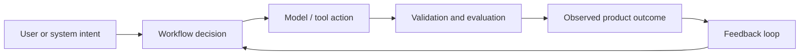

# From Features to Intelligence Systems

## 🎮 The Game

You are no longer just implementing a feature. You are designing an intelligence system that has to make decisions, call tools, recover from failure, and prove that it works.

**Scenario:** A startup asks you to build an AI product that real users will depend on. Your job is to turn the vague request into a controlled system: workflow, model decisions, tool boundaries, evals, observability, and cost controls.

> 🤔 Think it through before reading on:
> - Where can a deterministic function solve the problem better than an LLM?
> - Where does the system need judgment, retrieval, or orchestration?
> - What evidence would convince a senior engineer that this is production-ready?

## 🏗️ Your Running Project

**Course project:** Build an AI research/operator assistant that can take a complex user request, choose a workflow, call tools, retrieve knowledge, stream progress, evaluate its own output, and report cost/latency.

**This module adds:** Audit a conventional fullstack feature and redraw it as an intelligence system with inputs, model decisions, tools, controls, and feedback loops.

**Outcome:** Understand the new mental model of software engineering and map your current fullstack skills to AI-native roles.

## Topics

- Why coding is being commoditized
- Deterministic vs probabilistic systems
- What agentic AI means without hype
- New roles: orchestrator, evaluator, controller

## Visual Mental Model

The source chat framed the shift well: the old developer archetype was the **gunslinger** — fast, broad, and code-volume oriented. The AI-native developer is more like a composite role:

- **Sniper:** precise intervention at the highest-leverage failure point
- **Forensic analyst:** investigates why a model, workflow, or retrieval step failed
- **Air traffic controller:** routes agents, tools, models, users, and escalation paths safely

The course uses that framing, but upgrades it into a systems role: **mission planner + control systems engineer for intelligence under uncertainty**.

## Systems Pattern

The core pattern for this module is:

A senior AI engineer does not ask, "What prompt should I use?" first. They ask:

1. **What decision is being made?**
2. **What context is required?**
3. **What tools or APIs are allowed?**
4. **How do we know the answer is good?**
5. **What happens when the model is wrong, slow, expensive, or unavailable?**

## Design Table

| Step | Concept | Engineering Question |
| --- | --- | --- |
| 1 | Why coding is being commoditized | What failure mode, metric, or handoff does this topic create? |
| 2 | Deterministic vs probabilistic systems | What failure mode, metric, or handoff does this topic create? |
| 3 | What agentic AI means without hype | What failure mode, metric, or handoff does this topic create? |
| 4 | New roles: orchestrator, evaluator, controller | What failure mode, metric, or handoff does this topic create? |

## Build Exercise

Create a one-page design note for this module's project slice:

> **Audit a conventional fullstack feature and redraw it as an intelligence system with inputs, model decisions, tools, controls, and feedback loops.**

Include:

- Inputs and outputs
- Workflow steps
- Model/tool boundaries
- Guardrails or validation rules
- Evaluation metric or rubric
- Cost/latency risk

## What a Senior Reviewer Is Listening For

- You separate deterministic code from model-mediated judgment.
- You describe control points, not just prompts.
- You name failure modes and recovery paths.
- You define how quality will be measured.
- You can explain cost and latency tradeoffs in product terms.
