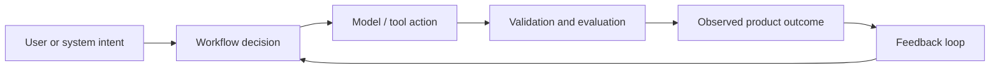

# LLMs as Probabilistic Components

## 🎮 The Game

You are no longer just implementing a feature. You are designing an intelligence system that has to make decisions, call tools, recover from failure, and prove that it works.

**Scenario:** A startup asks you to build an AI product that real users will depend on. Your job is to turn the vague request into a controlled system: workflow, model decisions, tool boundaries, evals, observability, and cost controls.

> 🤔 Think it through before reading on:
> - Where can a deterministic function solve the problem better than an LLM?
> - Where does the system need judgment, retrieval, or orchestration?
> - What evidence would convince a senior engineer that this is production-ready?

## 🏗️ Your Running Project

**Course project:** Build an AI research/operator assistant that can take a complex user request, choose a workflow, call tools, retrieve knowledge, stream progress, evaluate its own output, and report cost/latency.

**This module adds:** Design an LLM request contract that specifies inputs, schema, tool permissions, budget, and failure handling.

**Outcome:** Move from prompt tinkering to intentional system design.

## Topics

- Tokens, context windows, and embeddings
- Prompting vs structured control
- Tool use and function calling
- Hallucination, drift, and cost explosions

## Systems Pattern

The core pattern for this module is:

A senior AI engineer does not ask, "What prompt should I use?" first. They ask:

1. **What decision is being made?**
2. **What context is required?**
3. **What tools or APIs are allowed?**
4. **How do we know the answer is good?**
5. **What happens when the model is wrong, slow, expensive, or unavailable?**

## Design Table

| Step | Concept | Engineering Question |
| --- | --- | --- |
| 1 | Tokens, context windows, and embeddings | What failure mode, metric, or handoff does this topic create? |
| 2 | Prompting vs structured control | What failure mode, metric, or handoff does this topic create? |
| 3 | Tool use and function calling | What failure mode, metric, or handoff does this topic create? |
| 4 | Hallucination, drift, and cost explosions | What failure mode, metric, or handoff does this topic create? |

## Build Exercise

Create a one-page design note for this module's project slice:

> **Design an LLM request contract that specifies inputs, schema, tool permissions, budget, and failure handling.**

Include:

- Inputs and outputs
- Workflow steps
- Model/tool boundaries
- Guardrails or validation rules
- Evaluation metric or rubric
- Cost/latency risk

## What a Senior Reviewer Is Listening For

- You separate deterministic code from model-mediated judgment.
- You describe control points, not just prompts.
- You name failure modes and recovery paths.
- You define how quality will be measured.
- You can explain cost and latency tradeoffs in product terms.
