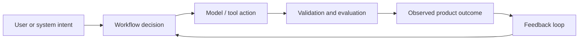

# Portfolio-Grade AI System

## 🎮 The Game

You are no longer just implementing a feature. You are designing an intelligence system that has to make decisions, call tools, recover from failure, and prove that it works.

**Scenario:** A startup asks you to build an AI product that real users will depend on. Your job is to turn the vague request into a controlled system: workflow, model decisions, tool boundaries, evals, observability, and cost controls.

> 🤔 Think it through before reading on:
> - Where can a deterministic function solve the problem better than an LLM?
> - Where does the system need judgment, retrieval, or orchestration?
> - What evidence would convince a senior engineer that this is production-ready?

## 🏗️ Your Running Project

**Course project:** Build an AI research/operator assistant that can take a complex user request, choose a workflow, call tools, retrieve knowledge, stream progress, evaluate its own output, and report cost/latency.

**This module adds:** Choose one capstone path and deliver architecture, implementation, eval report, and production runbook.

**Outcome:** Produce a senior-level portfolio project that proves you can build AI systems that actually work.

## Topics

- AI customer support agent
- Voice AI assistant
- AI research analyst
- Web3 agent
- Capstone requirements: workflow, guardrails, evals, cost and latency

## AI-Native Hiring Scorecard

Your capstone should read like evidence for a modern Senior AI Systems Engineer role. A reviewer should be able to see that you can:

- design decision-making workflows, not just pages and APIs
- constrain non-deterministic behavior with guardrails and schemas
- evaluate quality with rubrics, test sets, and regression gates
- operate the system with observability, versioning, cost limits, and rollback criteria

Portfolio rule: **a demo shows that it runs; an eval report shows that it works.**

## Systems Pattern

The core pattern for this module is:

A senior AI engineer does not ask, "What prompt should I use?" first. They ask:

1. **What decision is being made?**
2. **What context is required?**
3. **What tools or APIs are allowed?**
4. **How do we know the answer is good?**
5. **What happens when the model is wrong, slow, expensive, or unavailable?**

## Design Table

| Step | Concept | Engineering Question |
| --- | --- | --- |
| 1 | AI customer support agent | What failure mode, metric, or handoff does this topic create? |
| 2 | Voice AI assistant | What failure mode, metric, or handoff does this topic create? |
| 3 | AI research analyst | What failure mode, metric, or handoff does this topic create? |
| 4 | Web3 agent | What failure mode, metric, or handoff does this topic create? |
| 5 | Capstone requirements: workflow, guardrails, evals, cost and latency | What failure mode, metric, or handoff does this topic create? |

## Build Exercise

Create a one-page design note for this module's project slice:

> **Choose one capstone path and deliver architecture, implementation, eval report, and production runbook.**

Include:

- Inputs and outputs
- Workflow steps
- Model/tool boundaries
- Guardrails or validation rules
- Evaluation metric or rubric
- Cost/latency risk

## What a Senior Reviewer Is Listening For

- You separate deterministic code from model-mediated judgment.
- You describe control points, not just prompts.
- You name failure modes and recovery paths.
- You define how quality will be measured.
- You can explain cost and latency tradeoffs in product terms.
