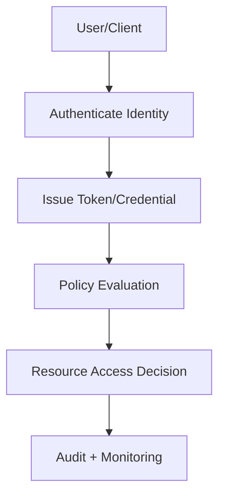

# Module Briefing: Authentication vs Authorization Fundamentals

**Meme opener:** "When prod says ‘just add login’ and security says ‘define trust boundaries first.’"

## Quick Recap

- This module sharpens one identity control area and how it fails under pressure.
- Focus on threat-model-driven choices, not checkbox implementations.
- Tie every protocol choice to UX, risk, and auditability.

## Concept Clarity

Identity is like a club with a bouncer and colored wristbands. Authentication checks your face at the door, authorization checks your wristband at each room.

## System sketch (mermaid)

## Case snapshot

A fintech team must reduce account takeovers without increasing sign-in abandonment. They combine phishing-resistant MFA, token hardening, and adaptive authorization policies per risk tier.

## Primary references

- [RFC 6749 OAuth 2.0](https://datatracker.ietf.org/doc/html/rfc6749)
- [OpenID Connect Core 1.0](https://openid.net/specs/openid-connect-core-1_0.html)
- [NIST SP 800-63](https://pages.nist.gov/800-63-3/)

## Downloadable artifacts

- [Module Briefing Checklist](/assets/courses/auth-training/module-briefing-checklist.md)
- [Scenario Worksheet](/assets/courses/auth-training/scenario-worksheet.md)
- [Primary References](/assets/courses/auth-training/primary-references.md)

## Media links

- [OAuth 2.1 Security BCP talks (YouTube search)](https://www.youtube.com/results?search_query=oauth+2.1+security+bcp)
- [FIDO Alliance webinars](https://fidoalliance.org/resources/)

## 😄 Meme Opener

## Video Boosters
- **Quick Recap video:** [Watch](/assets/courses/auth-training/videos/01-auth-fundamentals-quick-recap.mp4)
- **Concept Clarity video:** [Watch](/assets/courses/auth-training/videos/01-auth-fundamentals-concept-clarity.mp4)
