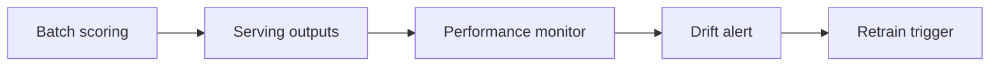

# Production Pipeline & Monitoring: Core Concepts

## 😄 Meme Opener
**Meme concept:** "Model AUC 0.89, retention still dropping... because nobody changed the intervention plan."  
**Why this hurts in real life:** prediction without action does not change outcomes.

## Quick Recap
- This module links modeling choices to retention business decisions.
- We optimize for intervention outcomes, not just offline metrics.
- Every stage ends with an owner/date action checkpoint.

## Concept Clarity
Think of churn prediction like weather forecasting for customer storms.  
A good forecast only helps if you actually close the windows and prepare before rain hits.

## Mermaid Visual

## Harvard-Style Case
### Case: Model decay after product change and missing drift alarms
**Context:** A growth team needed to reduce churn while maintaining efficient retention spend.

**Decision point:** Should the team trust headline model metrics or redesign decision policy and interventions first?

**Options considered:**
- Push current model directly into campaign workflow
- Pause and fix data quality / targeting policy gaps
- Delay churn work and focus only on top-funnel growth

**Action taken:** Team aligned labeling, thresholding, and intervention design to measurable retention outcomes.

**Outcome:** Better campaign efficiency and more credible forecast-to-outcome linkage.

**What we'd do differently:** Formalize causal testing and segment-level uplift measurement earlier.

**Discussion questions:**
1. Which signal would you monitor weekly to detect policy failure fastest?
2. How would you separate model error from intervention execution error?

**Sources:**
- https://cloud.google.com/architecture/mlops-continuous-delivery-and-automation-pipelines-in-machine-learning
- https://ml-ops.org/content/mlops-principles

## Primary References
- https://cloud.google.com/architecture/mlops-continuous-delivery-and-automation-pipelines-in-machine-learning
- https://ml-ops.org/content/mlops-principles

## Downloadable Practical Artifacts
- [Feature Window Checklist](/assets/courses/churn-modeling-academy/downloads/feature-window-checklist.md)
- [Leakage Audit Checklist](/assets/courses/churn-modeling-academy/downloads/leakage-audit-checklist.md)
- [Retention Experiment Template](/assets/courses/churn-modeling-academy/downloads/retention-experiment-template.md)
- [Monitoring KPI Template (CSV)](/assets/courses/churn-modeling-academy/downloads/monitoring-kpi-template.csv)

## Concept Clarity + TLDR Video
- **Concept Clarity video:** [Watch](/assets/courses/churn-modeling-academy/videos/05-production-and-monitoring-eli5.mp4)
- **Quick Recap video:** [Watch](/assets/courses/churn-modeling-academy/videos/05-production-and-monitoring-tldr.mp4)

## Anti-Pattern to Avoid
Do not treat model score quality as proof of business impact.
