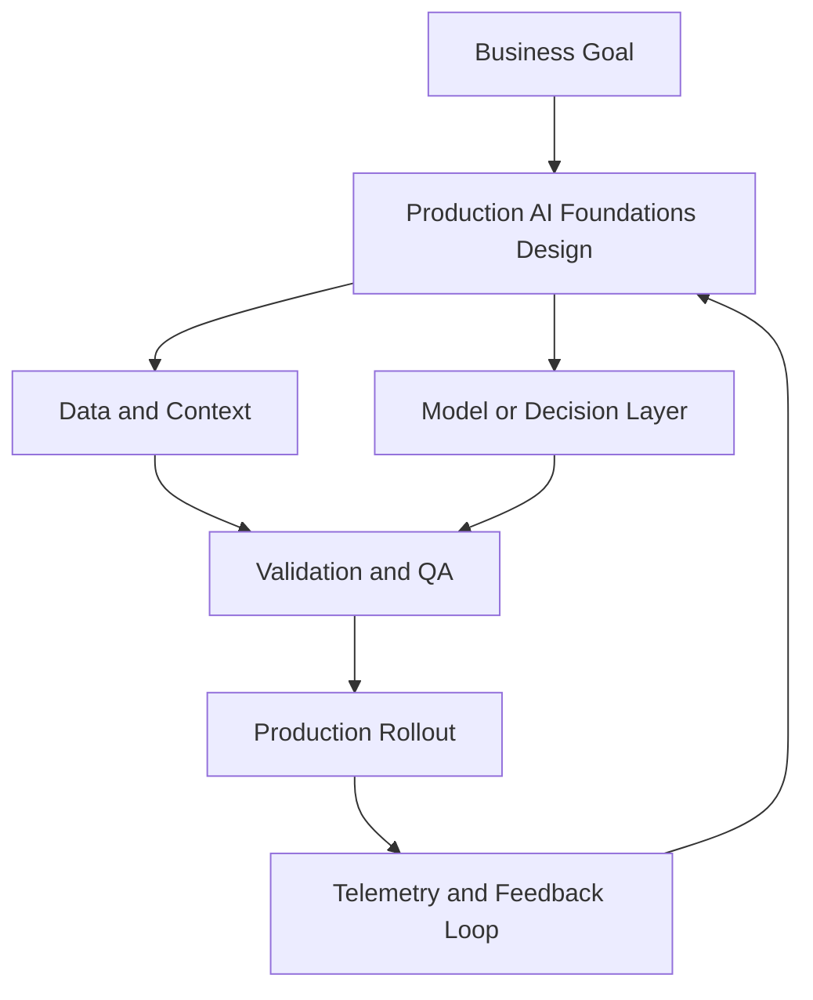

# Module 1 — Production AI Foundations (Intermediate)

## Why it matters

Intermediate builders already know how to get model output. Production teams need more: predictable quality, controlled cost, and clear ownership across data, application, and platform layers. This module gives you a system-level operating model you can use to design and review real production AI services.

## Intermediate Learning Objectives

By the end of this module, you should be able to:
- Translate business requirements into a production AI architecture with clear component boundaries.
- Define an evaluation contract (quality, latency, cost, and safety) before implementation.
- Identify reliability and governance controls needed for high-stakes workflows.
- Propose an iterative improvement loop using live telemetry and human feedback.

## Key Concepts

### 1) Capability framing and task decomposition
Break work into capability classes before picking models:
- **Deterministic transformation tasks** (classification, extraction, routing)
- **Knowledge-grounded generation tasks** (RAG, synthesis, Q&A)
- **Reasoning and multi-step workflow tasks** (agents, tool use, orchestration)

This decomposition avoids overusing expensive general models for tasks better handled by deterministic components.

### 2) Reference architecture layers
A practical production stack usually includes:
1. **Interface layer** (API/UI, auth, rate limits)
2. **Orchestration layer** (workflow engine, routing, retries, fallbacks)
3. **Intelligence layer** (LLMs, retrievers, rerankers, tool adapters)
4. **Data layer** (source systems, feature stores, vector/SQL stores, caches)
5. **Control layer** (observability, evals, policy checks, incident response)

### 3) Evaluation as a release gate
Treat evals as CI gates, not dashboards.
- Define a **golden set** with representative prompts and edge cases.
- Track at least four dimensions per release: quality, latency, cost, safety.
- Use a pass/fail rule for deployment (for example: no quality regression and p95 latency within SLO).

### 4) Reliability patterns for AI systems
- Timeouts + retries with bounded backoff
- Model fallback chains by capability tier
- Context window guardrails and truncation strategy
- Output validation and schema enforcement
- Circuit breakers for downstream dependency failures

### 5) Cost governance fundamentals
At intermediate depth, cost control must be designed in:
- Token budgets per request class
- Dynamic model routing by task complexity
- Caching strategy (prompt cache, retrieval cache, response cache)
- Cost observability per feature, tenant, and workflow stage

### 6) Human oversight and accountability
For consequential actions (financial, legal, customer-impacting), define:
- Approval checkpoints
- Audit log requirements
- Reversible actions and rollback procedures
- Ownership map for incident triage

## Build Lab

Create a **Production AI Architecture Review Pack** for one real use case (for example support copilot, contract analysis assistant, or internal analytics copilot):

1. Draw the end-to-end architecture (all five layers above).
2. Define 8-12 golden-set eval cases, including failure/edge scenarios.
3. Specify initial SLOs (quality proxy, p95 latency, and request cost band).
4. Add top five risks and corresponding controls.
5. Produce a release recommendation: ship / ship with guardrails / hold.

### Deliverables
- 1 architecture diagram
- 1 evaluation sheet
- 1 risk-and-controls table
- 1 release decision memo (max one page)

## Operator Case

**Scenario:** A health-tech SaaS wants an AI triage assistant for inbound patient messages. Response quality must be high, but advice must remain non-diagnostic and policy compliant.

Design an approach that covers:
- Required architecture layers and where policy checks live
- A minimum viable eval suite for launch readiness
- Human-in-the-loop rules for uncertain or high-risk responses
- A rollback plan if quality regresses after a provider model update

## Checkpoint Quiz

See `content/quizzes/01-production-ai-foundations.json`

## Tools and Further Reading
- [NIST AI Risk Management Framework](https://www.nist.gov/itl/ai-risk-management-framework)
- [Google SRE Workbook — Service Level Objectives](https://sre.google/workbook/)
- [OpenAI Evals Cookbook](https://cookbook.openai.com/)
- [Lilian Weng — LLM Powered Autonomous Agents](https://lilianweng.github.io/posts/2023-06-23-agent/)

<!-- VNEXT_AUGMENTATION -->
## vNext Lesson Augmentation

### Meme opener

### Quick Recap
- Start with a business outcome and measurable success criteria.
- Design the operating workflow before selecting tools.
- Add validation, observability, and rollback controls from day one.
- Use lightweight artifacts so decisions are auditable and repeatable.

### Concept Clarity
Think of this module like building a smart kitchen. The recipe (process), ingredients (data), and tasting checks (evaluation) matter more than buying the fanciest oven. If one part fails, you need a backup plan so dinner still gets served.

### System map (mermaid)

### Harvard-style case
**Case:** Production AI Foundations in a mid-market business unit.  
**Background:** Team needs faster execution without losing governance.  
**Complication:** Metrics are improving in pilots but unstable in production.  
**Analysis:** Missing control points (ownership, QA gates, and incident rules) increase variance.  
**Recommendation:** Introduce a phased operating model with explicit guardrails, then scale only when KPI and risk thresholds hold for two consecutive cycles.

### Primary references
- [NIST AI RMF](https://www.nist.gov/itl/ai-risk-management-framework)
- [Google SRE Workbook (SLOs)](https://sre.google/workbook/)
- [Harvard Business Review (Analytics & AI)](https://hbr.org/topic/analytics-and-ai)

### Downloadable artifacts
- [Module worksheet](/assets/courses/genai-ml-academy/downloads/01-production-ai-foundations-worksheet.md)
- [Execution checklist (CSV)](/assets/courses/genai-ml-academy/downloads/01-production-ai-foundations-checklist.csv)

### Media links
- [Module media list](/assets/courses/genai-ml-academy/videos/01-production-ai-foundations-media.md)
- [MIT Sloan AI channel](https://www.youtube.com/@mitsloan)
- [Stanford HAI talks](https://www.youtube.com/@stanfordhai)

## 😄 Meme Opener

## Video Boosters
- **Quick Recap video:** [Watch](/assets/courses/genai-ml-academy/videos/01-production-ai-foundations-quick-recap.mp4)
- **Concept Clarity video:** [Watch](/assets/courses/genai-ml-academy/videos/01-production-ai-foundations-concept-clarity.mp4)
