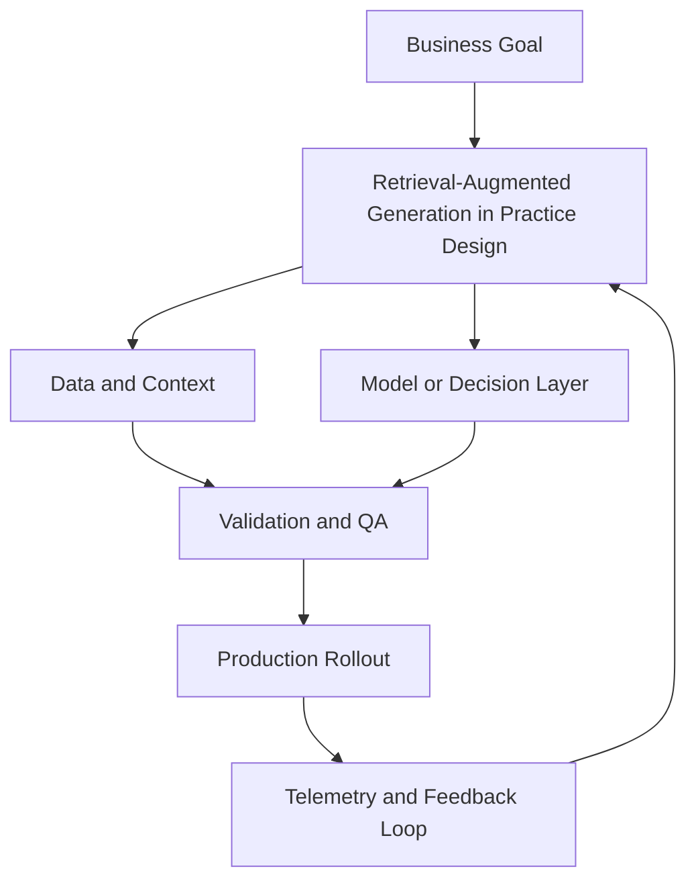

# Module 2 — Retrieval-Augmented Generation in Practice (Intermediate)

## Why it matters

Beginner RAG gets demos working. Intermediate RAG gets production answers right under noise, scale, and changing corpora. This module focuses on retrieval quality engineering, evaluation strategy, and operational tradeoffs.

## Intermediate Learning Objectives

By the end of this module, you should be able to:
- Design a RAG pipeline that separates indexing, retrieval, reranking, and generation concerns.
- Choose chunking and embedding strategies based on document structure and query types.
- Instrument retrieval metrics and diagnose failure patterns systematically.
- Implement citation, freshness, and governance controls for enterprise use.

## Key Concepts

### 1) Retrieval pipeline architecture
Treat RAG as a multi-stage system:
1. **Ingestion and normalization** (dedupe, cleanup, metadata extraction)
2. **Chunking and indexing** (versioned embeddings + metadata)
3. **Candidate retrieval** (dense/sparse/hybrid)
4. **Reranking** (cross-encoder or LLM reranker)
5. **Context assembly** (budget-aware prompt packing)
6. **Generation and citation formatting**

### 2) Chunking as an optimization problem
Intermediate strategy goes beyond fixed windows.
- Use document-aware chunking (sections, headings, tables)
- Preserve source lineage fields (`doc_id`, `section_id`, `version`)
- Tune chunk size against retrieval precision and context efficiency
- Apply overlap selectively where cross-boundary semantics matter

### 3) Hybrid retrieval and reranking
Dense retrieval alone misses lexical precision; sparse retrieval alone misses semantic intent.
- Use hybrid retrieval (BM25 + vectors)
- Merge with score normalization or rank fusion
- Add reranking on top-k candidates to improve final context quality

### 4) Retrieval evaluation metrics
Track retrieval separately from generation:
- **Recall@k**: did we fetch a relevant chunk?
- **Precision@k**: how many retrieved chunks are useful?
- **MRR / nDCG**: ranking quality
- **Context hit rate**: whether final prompt includes answer-bearing evidence

### 5) Freshness and index governance
Production corpora change constantly.
- Define index rebuild/incremental update policy
- Enforce document versioning and tombstoning for deleted content
- Run staleness checks and stale-citation alarms

### 6) Guardrails and response policy
- Require grounded answers with explicit citations
- Detect unsupported claims (answer not backed by retrieved context)
- Add refusal behavior for low-confidence retrieval conditions

## Build Lab

Implement a **retrieval quality benchmark** for a domain corpus (100+ documents):

1. Build two retrieval variants:
   - Baseline: dense only
   - Candidate: hybrid + reranking
2. Create 25-40 benchmark queries with expected evidence docs.
3. Measure Recall@5, Precision@5, and MRR for both variants.
4. Compare generation quality on top of each retrieval setup.
5. Write a recommendation memo with go/no-go for candidate rollout.

### Deliverables
- Retrieval benchmark dataset (queries + expected evidence)
- Metrics table comparing both variants
- Failure taxonomy with at least 3 recurring error types
- Rollout recommendation with risk notes

## Operator Case

**Scenario:** A legal operations team is using RAG across contracts and policy manuals. They report occasional confident but uncited answers, especially after weekly document updates.

Propose:
- A retrieval architecture adjustment to improve grounding
- An index freshness policy
- A monitoring dashboard for retrieval drift
- A release policy for re-indexing + regression checks

## Checkpoint Quiz

See `content/quizzes/02-rag-in-practice.json`

## Tools and Further Reading
- [Qdrant docs](https://qdrant.tech/documentation/)
- [Elastic BM25 overview](https://www.elastic.co/guide/en/elasticsearch/reference/current/index-modules-similarity.html)
- [Sentence Transformers reranking guide](https://www.sbert.net/examples/applications/retrieve_rerank/README.html)
- [RAG triad (Context relevance, Groundedness, Answer relevance)](https://www.trulens.org/trulens_eval/getting_started/core_concepts/rag_triad/)

<!-- VNEXT_AUGMENTATION -->
## vNext Lesson Augmentation

### Meme opener

### Quick Recap
- Start with a business outcome and measurable success criteria.
- Design the operating workflow before selecting tools.
- Add validation, observability, and rollback controls from day one.
- Use lightweight artifacts so decisions are auditable and repeatable.

### Concept Clarity
Think of this module like building a smart kitchen. The recipe (process), ingredients (data), and tasting checks (evaluation) matter more than buying the fanciest oven. If one part fails, you need a backup plan so dinner still gets served.

### System map (mermaid)

### Harvard-style case
**Case:** Retrieval-Augmented Generation in Practice in a mid-market business unit.  
**Background:** Team needs faster execution without losing governance.  
**Complication:** Metrics are improving in pilots but unstable in production.  
**Analysis:** Missing control points (ownership, QA gates, and incident rules) increase variance.  
**Recommendation:** Introduce a phased operating model with explicit guardrails, then scale only when KPI and risk thresholds hold for two consecutive cycles.

### Primary references
- [NIST AI RMF](https://www.nist.gov/itl/ai-risk-management-framework)
- [Google SRE Workbook (SLOs)](https://sre.google/workbook/)
- [Harvard Business Review (Analytics & AI)](https://hbr.org/topic/analytics-and-ai)

### Downloadable artifacts
- [Module worksheet](/assets/courses/genai-ml-academy/downloads/02-rag-in-practice-worksheet.md)
- [Execution checklist (CSV)](/assets/courses/genai-ml-academy/downloads/02-rag-in-practice-checklist.csv)

### Media links
- [Module media list](/assets/courses/genai-ml-academy/videos/02-rag-in-practice-media.md)
- [MIT Sloan AI channel](https://www.youtube.com/@mitsloan)
- [Stanford HAI talks](https://www.youtube.com/@stanfordhai)

## 😄 Meme Opener

## Video Boosters
- **Quick Recap video:** [Watch](/assets/courses/genai-ml-academy/videos/02-rag-in-practice-quick-recap.mp4)
- **Concept Clarity video:** [Watch](/assets/courses/genai-ml-academy/videos/02-rag-in-practice-concept-clarity.mp4)
