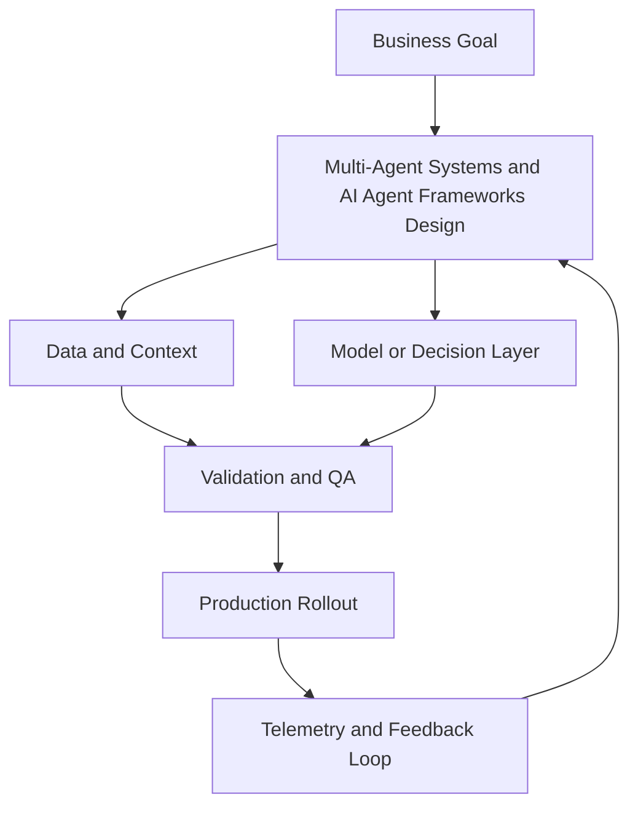

# Module 3 — Multi-Agent Systems and AI Agent Frameworks (Intermediate)

## Why it matters

Intermediate teams move from single prompts to coordinated systems. Multi-agent architectures can increase throughput and quality, but only when role boundaries, handoff contracts, and failure controls are explicit.

## Intermediate Learning Objectives

By the end of this module, you should be able to:
- Design a role-based multi-agent topology for non-trivial workflows.
- Define clear agent interfaces (inputs, outputs, and quality expectations).
- Select an agent framework based on state complexity and production constraints.
- Implement cost, reliability, and safety controls that prevent runaway behavior.

## Key Concepts

### 1) Role topology and control flow
Common production topologies:
- **Planner → Specialists → Synthesizer**
- **Router → Domain agents → Verifier**
- **Executor + Critic loop**

Choose topology based on task decomposition, not framework preference.

### 2) Agent contracts and typed handoffs
Every handoff should define:
- Input schema
- Expected output schema
- Acceptance criteria
- Timeout/retry policy

Typed contracts reduce ambiguity and prevent silent quality degradation between agent stages.

### 3) Coordination models
- **Centralized orchestration**: one controller governs state and transitions
- **Conversation-based coordination**: agents negotiate via messages
- **Event-driven coordination**: tasks emit events consumed by downstream agents

Intermediate deployments usually favor centralized orchestration for observability and policy enforcement.

### 4) Framework selection matrix
Use constraints to choose tools:
- Need explicit state, branching, checkpoints → **LangGraph**
- Need rapid role-based team prototyping → **CrewAI**
- Need conversational debate/critique patterns → **AutoGen**
- Need simple lightweight handoffs → **Swarm**

### 5) Reliability and budget controls
Production multi-agent systems need hard limits:
- Max turns per task and max tool calls per agent
- Token budget caps by workflow stage
- Retry boundaries per tool type
- Dead-letter handling for failed handoffs

### 6) Evaluation for multi-agent systems
Evaluate both outcome and process:
- Final task quality metrics
- Intermediate step correctness
- Handoff completeness
- Cost per completed task
- Time-to-completion percentile bands

## Build Lab

Design and implement a **3-agent workflow** for competitive intelligence:
- Agent A: source collection
- Agent B: structured extraction
- Agent C: synthesis + recommendation

Requirements:
1. Define JSON schemas for each handoff.
2. Add a verifier step that rejects low-confidence extractions.
3. Enforce max-turn and max-cost guards.
4. Log per-agent metrics (latency, token usage, failure count).
5. Run 10 tasks and summarize performance.

### Deliverables
- Topology diagram
- Agent handoff contract files
- Guardrail configuration
- Run report with quality/cost/latency summary

## Operator Case

**Scenario:** A product intelligence team uses a 4-agent workflow. Quality is good, but costs doubled over 3 weeks and average completion time is unstable.

Diagnose and propose:
- Where budget controls should be introduced
- Which agent stages should be collapsed or rerouted
- A minimal evaluation dashboard for weekly governance
- A rollout plan to improve efficiency without sacrificing quality

## Checkpoint Quiz

See `content/quizzes/03-multi-agent-systems-and-frameworks.json`

## Tools and Further Reading
- [LangGraph docs](https://langchain-ai.github.io/langgraph/)
- [CrewAI docs](https://docs.crewai.com/)
- [AutoGen docs](https://microsoft.github.io/autogen/)
- [OpenAI function calling](https://platform.openai.com/docs/guides/function-calling)

<!-- VNEXT_AUGMENTATION -->
## vNext Lesson Augmentation

### Meme opener

### Quick Recap
- Start with a business outcome and measurable success criteria.
- Design the operating workflow before selecting tools.
- Add validation, observability, and rollback controls from day one.
- Use lightweight artifacts so decisions are auditable and repeatable.

### Concept Clarity
Think of this module like building a smart kitchen. The recipe (process), ingredients (data), and tasting checks (evaluation) matter more than buying the fanciest oven. If one part fails, you need a backup plan so dinner still gets served.

### System map (mermaid)

### Harvard-style case
**Case:** Multi-Agent Systems and AI Agent Frameworks in a mid-market business unit.  
**Background:** Team needs faster execution without losing governance.  
**Complication:** Metrics are improving in pilots but unstable in production.  
**Analysis:** Missing control points (ownership, QA gates, and incident rules) increase variance.  
**Recommendation:** Introduce a phased operating model with explicit guardrails, then scale only when KPI and risk thresholds hold for two consecutive cycles.

### Primary references
- [NIST AI RMF](https://www.nist.gov/itl/ai-risk-management-framework)
- [Google SRE Workbook (SLOs)](https://sre.google/workbook/)
- [Harvard Business Review (Analytics & AI)](https://hbr.org/topic/analytics-and-ai)

### Downloadable artifacts
- [Module worksheet](/assets/courses/genai-ml-academy/downloads/03-multi-agent-systems-and-frameworks-worksheet.md)
- [Execution checklist (CSV)](/assets/courses/genai-ml-academy/downloads/03-multi-agent-systems-and-frameworks-checklist.csv)

### Media links
- [Module media list](/assets/courses/genai-ml-academy/videos/03-multi-agent-systems-and-frameworks-media.md)
- [MIT Sloan AI channel](https://www.youtube.com/@mitsloan)
- [Stanford HAI talks](https://www.youtube.com/@stanfordhai)

## 😄 Meme Opener

## Video Boosters
- **Quick Recap video:** [Watch](/assets/courses/genai-ml-academy/videos/03-multi-agent-systems-and-frameworks-quick-recap.mp4)
- **Concept Clarity video:** [Watch](/assets/courses/genai-ml-academy/videos/03-multi-agent-systems-and-frameworks-concept-clarity.mp4)

---

## 🎓 Harvard-Style Case Study — State handoffs and failure propagation

**Context:** A multi-agent research workflow had 4 specialist agents. When Agent 2 timed out, Agent 3 assumed it had completed. The downstream output was fabricated from incomplete context.

**The tension:** Move fast vs build safeguards that prevent silent quality degradation.

**Decision options:**
1. Add explicit state handoff contracts between agents
2. add timeout-aware retry at the orchestrator
3. add a validation step before any downstream agent consumes output

**Discussion questions:**
1. What observable signal would have caught this before it reached production?
2. Which option gives the best risk/effort tradeoff for a small team?
3. Write a one-sentence runbook entry for this failure mode.

---

## 🤖 Solo AI Discussion Prompt

**Red Team:** "You are reviewing this Multi-Agent Systems system. Assume it fails in production. Find the top 3 failure modes and propose the minimum viable fix for each."
