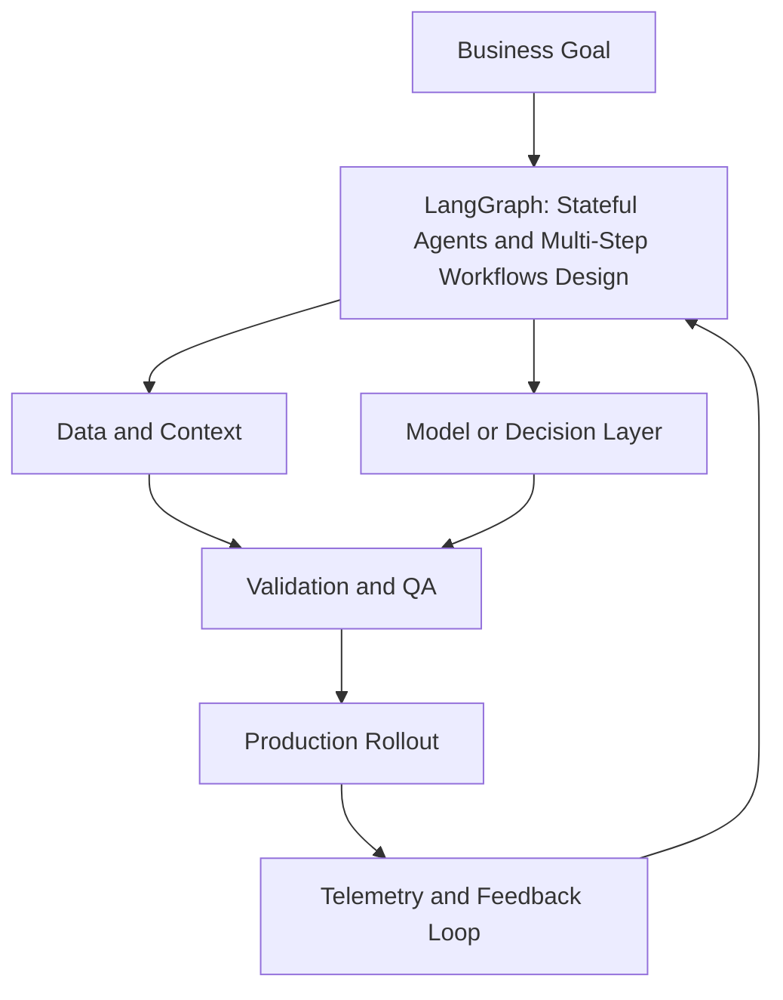

# Module 4 — LangGraph: Stateful Agents and Multi-Step Workflows (Intermediate)

## Why it matters

At intermediate maturity, the challenge is not writing one good prompt. The challenge is running long, branching workflows safely, with resumability and traceability. LangGraph is a strong fit because it treats workflow state and control flow as first-class concerns.

## Intermediate Learning Objectives

By the end of this module, you should be able to:
- Model a non-trivial agent workflow as a typed state graph.
- Implement conditional routing, retries, and human approval checkpoints.
- Persist workflow state with checkpointing for resume and replay.
- Instrument workflow traces to debug node-level failures and regressions.

## Key Concepts

### 1) Typed state design
Your state object should separate:
- **Inputs** (immutable request context)
- **Working memory** (intermediate artifacts)
- **Control flags** (routing decisions, retry counters)
- **Outputs** (final deliverables + provenance)

Typed state reduces accidental coupling between nodes.

### 2) Node design and side-effect boundaries
Each node should do one bounded thing:
- Validate or transform state
- Call a tool or model
- Return deterministic state updates

Keep irreversible side effects (email send, writes to prod systems) behind approval-gated nodes.

### 3) Conditional edges and recovery paths
Intermediate workflows need explicit recovery branches:
- Validation fail → correction node
- Tool timeout → retry node with capped attempts
- Low confidence → human review queue
- Fatal error → terminal failure node with diagnostics

### 4) Checkpointing and resumability
Use persistent checkpointers (SQLite/Postgres) to support:
- Resume after process restart
- Incident debugging via replay
- Branch testing from historical states

Define checkpoint retention and cleanup policy to control storage growth.

### 5) Human-in-the-loop controls
Add interrupts where decisions are consequential:
- Before financial or customer-facing actions
- When confidence drops below threshold
- When policy violations are detected

Approval payload should include: proposed action, evidence, confidence, and rollback path.

### 6) Observability for production graphs
Track:
- Per-node latency and failure rate
- Retry volume by node
- State size growth over workflow lifetime
- Cost and token usage by execution path

This helps identify bottlenecks and unstable branches.

## Build Lab

Build a **LangGraph research-to-brief pipeline** with these nodes:
1. `collect_sources`
2. `extract_findings`
3. `draft_brief`
4. `quality_review`
5. `human_approval`
6. `publish`

Requirements:
- Typed state with retry counters and confidence score
- Conditional branch from `quality_review` back to `draft_brief` if score < threshold
- Persistent checkpointer enabled
- Interrupt before `publish`
- Structured execution log with node timings

### Deliverables
- State schema and graph diagram
- Minimal runnable graph implementation
- One replay example showing resume from checkpoint
- Post-run diagnostics summary

## Operator Case

**Scenario:** A compliance operations team runs a LangGraph workflow that drafts policy responses. Occasionally, the workflow loops several times and then publishes a low-confidence response after a timeout recovery path.

Propose:
- A safer routing policy for low-confidence drafts
- Retry and loop guard changes
- Where to place mandatory human approval
- Monitoring alerts that catch this failure mode early

## Checkpoint Quiz

See `content/quizzes/04-langgraph-stateful-agents.json`

## Tools and Further Reading
- [LangGraph docs](https://langchain-ai.github.io/langgraph/)
- [LangGraph persistence](https://langchain-ai.github.io/langgraph/how-tos/persistence/)
- [LangGraph human-in-the-loop](https://langchain-ai.github.io/langgraph/how-tos/human_in_the_loop/)
- [LangSmith tracing docs](https://docs.smith.langchain.com/)

<!-- VNEXT_AUGMENTATION -->
## vNext Lesson Augmentation

### Meme opener

### Quick Recap
- Start with a business outcome and measurable success criteria.
- Design the operating workflow before selecting tools.
- Add validation, observability, and rollback controls from day one.
- Use lightweight artifacts so decisions are auditable and repeatable.

### Concept Clarity
Think of this module like building a smart kitchen. The recipe (process), ingredients (data), and tasting checks (evaluation) matter more than buying the fanciest oven. If one part fails, you need a backup plan so dinner still gets served.

### System map (mermaid)

### Harvard-style case
**Case:** LangGraph: Stateful Agents and Multi-Step Workflows in a mid-market business unit.  
**Background:** Team needs faster execution without losing governance.  
**Complication:** Metrics are improving in pilots but unstable in production.  
**Analysis:** Missing control points (ownership, QA gates, and incident rules) increase variance.  
**Recommendation:** Introduce a phased operating model with explicit guardrails, then scale only when KPI and risk thresholds hold for two consecutive cycles.

### Primary references
- [NIST AI RMF](https://www.nist.gov/itl/ai-risk-management-framework)
- [Google SRE Workbook (SLOs)](https://sre.google/workbook/)
- [Harvard Business Review (Analytics & AI)](https://hbr.org/topic/analytics-and-ai)

### Downloadable artifacts
- [Module worksheet](/assets/courses/genai-ml-academy/downloads/04-langgraph-stateful-agents-worksheet.md)
- [Execution checklist (CSV)](/assets/courses/genai-ml-academy/downloads/04-langgraph-stateful-agents-checklist.csv)

### Media links
- [Module media list](/assets/courses/genai-ml-academy/videos/04-langgraph-stateful-agents-media.md)
- [MIT Sloan AI channel](https://www.youtube.com/@mitsloan)
- [Stanford HAI talks](https://www.youtube.com/@stanfordhai)

## 😄 Meme Opener

## Video Boosters
- **Quick Recap video:** [Watch](/assets/courses/genai-ml-academy/videos/04-langgraph-stateful-agents-quick-recap.mp4)
- **Concept Clarity video:** [Watch](/assets/courses/genai-ml-academy/videos/04-langgraph-stateful-agents-concept-clarity.mp4)
