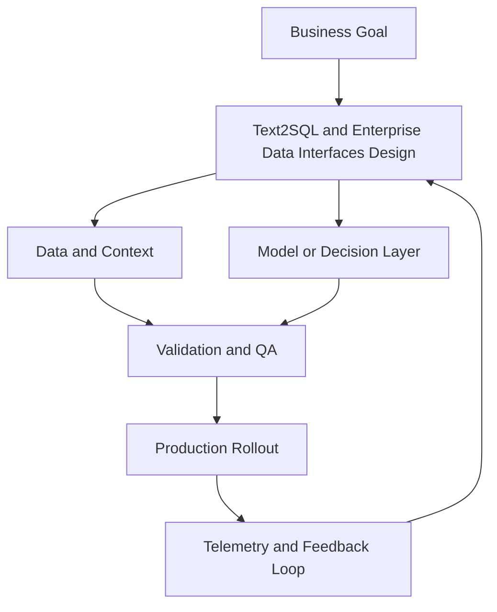

# Module 5 — Text2SQL and Enterprise Data Interfaces

## Beginner track

In this beginner pass, you will learn how to safely turn plain-English questions into SQL, even if you are new to analytics engineering.

## Why it matters

Most business data lives in SQL databases, but most business users do not write SQL. Text2SQL bridges that gap by letting users ask questions in natural language while still querying trusted enterprise data.

## Key Concepts

### 1) Schema grounding
A model writes better SQL when it can see:
- table names
- column names
- column descriptions
- relationships (foreign keys)

Without schema context, the model guesses and query accuracy drops fast.

### 2) Prompt structure for SQL generation
A strong Text2SQL prompt usually includes:
- the user question
- allowed tables/columns
- SQL dialect (`PostgreSQL`, `BigQuery`, etc.)
- rules (read-only, no destructive queries)

### 3) Query validation before execution
Never execute raw model SQL directly in production.
Use a validation layer for:
- syntax checks
- deny-listed commands (`DROP`, `DELETE`, `ALTER`)
- row limits for safety

### 4) Semantic layer basics
A semantic layer defines business metrics once, for example:
- `active_customers`
- `monthly_recurring_revenue`
- `churn_rate`

This prevents each prompt from redefining metrics differently.

### 5) Human-readable explanations
A production Text2SQL assistant should return:
- generated SQL
- plain-English explanation
- assumptions made

This builds trust and makes auditing easier.

## Build Lab (Beginner)

Build a starter Text2SQL flow:
1. Use a sample schema with 3–5 tables (customers, orders, products, payments).
2. Write a prompt template with schema + SQL dialect + safety rules.
3. Create 20 user questions of mixed difficulty.
4. Generate SQL and score each query as: correct / partially correct / incorrect.
5. Add a SQL guardrail that blocks unsafe statements.

Deliverable: a small scorecard showing accuracy across 20 questions.

## Operator Case

**Scenario:** A sales manager asks, “Show this quarter’s top 10 products by revenue in NSW.”

As operator, define:
- what schema context the model needs
- what SQL safety checks run before execution
- what output format the manager should receive

## Checkpoint Quiz

See `content/quizzes/05-text2sql-enterprise-data.json`

## Tools and Further Reading
- [Text-to-SQL Survey (overview)](https://arxiv.org/abs/2208.13629)
- [SQLGlot (SQL parsing and validation)](https://github.com/tobymao/sqlglot)
- [dbt semantic layer concepts](https://docs.getdbt.com/docs/build/semantic-models)

<!-- VNEXT_AUGMENTATION -->
## vNext Lesson Augmentation

### Meme opener

### Quick Recap
- Start with a business outcome and measurable success criteria.
- Design the operating workflow before selecting tools.
- Add validation, observability, and rollback controls from day one.
- Use lightweight artifacts so decisions are auditable and repeatable.

### Concept Clarity
Think of this module like building a smart kitchen. The recipe (process), ingredients (data), and tasting checks (evaluation) matter more than buying the fanciest oven. If one part fails, you need a backup plan so dinner still gets served.

### System map (mermaid)

### Harvard-style case
**Case:** Text2SQL and Enterprise Data Interfaces in a mid-market business unit.  
**Background:** Team needs faster execution without losing governance.  
**Complication:** Metrics are improving in pilots but unstable in production.  
**Analysis:** Missing control points (ownership, QA gates, and incident rules) increase variance.  
**Recommendation:** Introduce a phased operating model with explicit guardrails, then scale only when KPI and risk thresholds hold for two consecutive cycles.

### Primary references
- [NIST AI RMF](https://www.nist.gov/itl/ai-risk-management-framework)
- [Google SRE Workbook (SLOs)](https://sre.google/workbook/)
- [Harvard Business Review (Analytics & AI)](https://hbr.org/topic/analytics-and-ai)

### Downloadable artifacts
- [Module worksheet](/assets/courses/genai-ml-academy/downloads/05-text2sql-enterprise-data-worksheet.md)
- [Execution checklist (CSV)](/assets/courses/genai-ml-academy/downloads/05-text2sql-enterprise-data-checklist.csv)

### Media links
- [Module media list](/assets/courses/genai-ml-academy/videos/05-text2sql-enterprise-data-media.md)
- [MIT Sloan AI channel](https://www.youtube.com/@mitsloan)
- [Stanford HAI talks](https://www.youtube.com/@stanfordhai)

## 😄 Meme Opener

## Video Boosters
- **Quick Recap video:** [Watch](/assets/courses/genai-ml-academy/videos/05-text2sql-enterprise-data-quick-recap.mp4)
- **Concept Clarity video:** [Watch](/assets/courses/genai-ml-academy/videos/05-text2sql-enterprise-data-concept-clarity.mp4)
