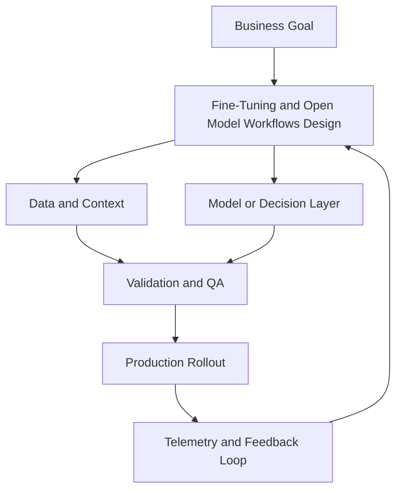

# Module 6 — Fine-Tuning and Open Model Workflows

## Beginner track

In this beginner pass, you will learn when fine-tuning helps, when it does not, and how to run a simple open-model workflow safely.

## Why it matters

Teams often jump to fine-tuning too early. In production, the best sequence is usually:
1) prompt improvements
2) retrieval improvements
3) fine-tuning only when needed

Learning this order saves time, cost, and rework.

## Key Concepts

### 1) Fine-tuning vs prompt engineering vs RAG
Use:
- **Prompt engineering** for instruction clarity
- **RAG** for up-to-date or private knowledge
- **Fine-tuning** for stable behaviour/style across many requests

### 2) Dataset quality basics
For beginner fine-tuning, prioritize:
- clean instruction-response pairs
- consistent format
- de-duplication
- removing low-quality examples

Bad data usually creates bad model behaviour.

### 3) Supervised fine-tuning (SFT)
SFT teaches a model to follow your task format better by training on labeled examples.
Good first target: 300–1,000 high-quality samples for a narrow task.

### 4) LoRA and QLoRA
These are parameter-efficient methods:
- train fewer parameters
- reduce VRAM cost
- keep the base model mostly unchanged

Great for beginner and small-team workflows.

### 5) Evaluation before deployment
Evaluate on a holdout set and compare:
- base model
- prompt-only baseline
- fine-tuned model

If gain is small, do not ship fine-tuning yet.

## Build Lab (Beginner)

Create a beginner fine-tuning plan:
1. Pick one narrow task (for example, structured support summarisation).
2. Prepare 500 instruction-response pairs in JSONL format.
3. Define a LoRA config for a 7B model (rank, alpha, dropout).
4. Split train/validation sets.
5. Propose an evaluation rubric (accuracy, format compliance, hallucination rate).

Deliverable: dataset sample + configuration + eval plan.

## Operator Case

**Scenario:** Your team wants a model that always responds in strict JSON for internal ticket triage.

As operator, decide:
- whether prompt-only is enough
- what examples must be in the training data
- what regression checks are required before rollout

## Checkpoint Quiz

See `content/quizzes/06-fine-tuning-open-models.json`

## Tools and Further Reading
- [Hugging Face PEFT docs](https://huggingface.co/docs/peft/index)
- [QLoRA paper](https://arxiv.org/abs/2305.14314)
- [Hugging Face TRL](https://huggingface.co/docs/trl/index)

<!-- VNEXT_AUGMENTATION -->
## vNext Lesson Augmentation

### Meme opener

### Quick Recap
- Start with a business outcome and measurable success criteria.
- Design the operating workflow before selecting tools.
- Add validation, observability, and rollback controls from day one.
- Use lightweight artifacts so decisions are auditable and repeatable.

### Concept Clarity
Think of this module like building a smart kitchen. The recipe (process), ingredients (data), and tasting checks (evaluation) matter more than buying the fanciest oven. If one part fails, you need a backup plan so dinner still gets served.

### System map (mermaid)

### Harvard-style case
**Case:** Fine-Tuning and Open Model Workflows in a mid-market business unit.  
**Background:** Team needs faster execution without losing governance.  
**Complication:** Metrics are improving in pilots but unstable in production.  
**Analysis:** Missing control points (ownership, QA gates, and incident rules) increase variance.  
**Recommendation:** Introduce a phased operating model with explicit guardrails, then scale only when KPI and risk thresholds hold for two consecutive cycles.

### Primary references
- [NIST AI RMF](https://www.nist.gov/itl/ai-risk-management-framework)
- [Google SRE Workbook (SLOs)](https://sre.google/workbook/)
- [Harvard Business Review (Analytics & AI)](https://hbr.org/topic/analytics-and-ai)

### Downloadable artifacts
- [Module worksheet](/assets/courses/genai-ml-academy/downloads/06-fine-tuning-open-models-worksheet.md)
- [Execution checklist (CSV)](/assets/courses/genai-ml-academy/downloads/06-fine-tuning-open-models-checklist.csv)

### Media links
- [Module media list](/assets/courses/genai-ml-academy/videos/06-fine-tuning-open-models-media.md)
- [MIT Sloan AI channel](https://www.youtube.com/@mitsloan)
- [Stanford HAI talks](https://www.youtube.com/@stanfordhai)

## 😄 Meme Opener

## Video Boosters
- **Quick Recap video:** [Watch](/assets/courses/genai-ml-academy/videos/06-fine-tuning-open-models-quick-recap.mp4)
- **Concept Clarity video:** [Watch](/assets/courses/genai-ml-academy/videos/06-fine-tuning-open-models-concept-clarity.mp4)
