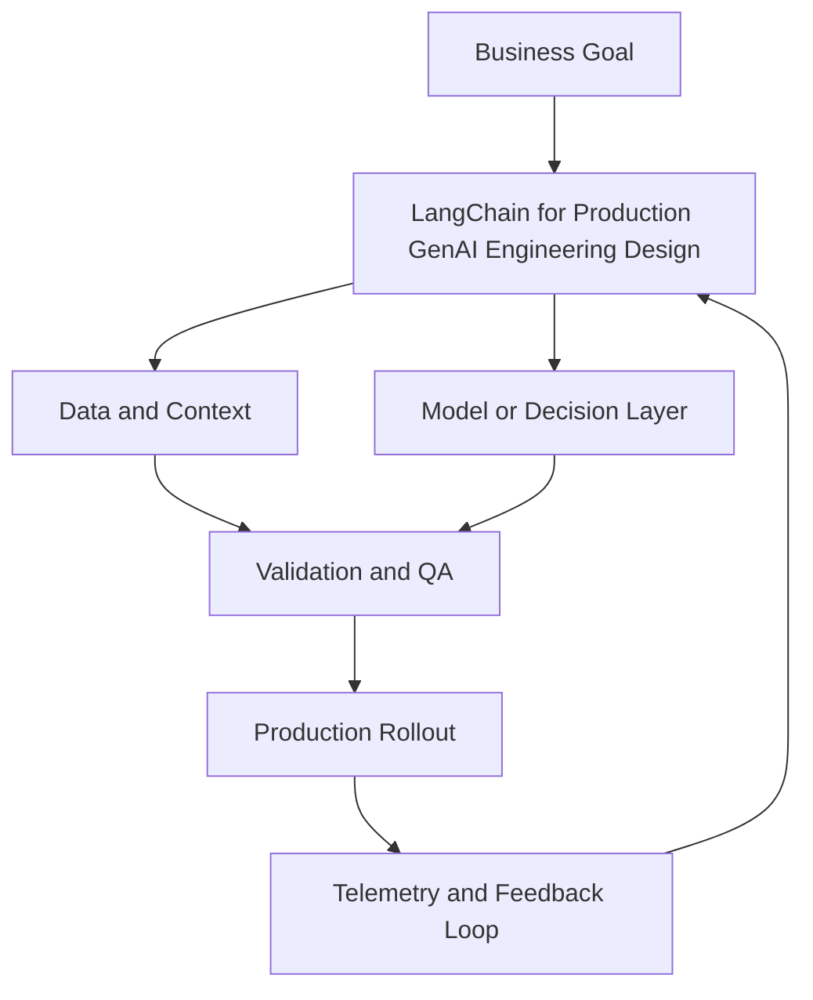

# Module 7 — LangChain for Production GenAI Engineering

## Why it matters

LangChain is the most widely adopted GenAI application framework. Understanding it deeply — not just the tutorials, but the production patterns — is a forcing function for building real systems. This module goes from basics to production: LCEL, agents, memory, tool integration, streaming, and observability.

## Key Concepts

### LangChain architecture

LangChain is built around the `Runnable` interface. Every component — prompts, models, parsers, retrievers, tools — implements the same interface, making composition predictable.

**LCEL (LangChain Expression Language)** uses Python's `|` operator:
```python
chain = prompt | model | output_parser
result = chain.invoke({"question": "What is RAG?"})
```

Key Runnable methods: `.invoke()`, `.stream()`, `.batch()`, `.astream()`, `.ainvoke()`

### Prompt templates
```python
from langchain_core.prompts import ChatPromptTemplate

prompt = ChatPromptTemplate.from_messages([
    ("system", "You are a helpful assistant specialising in {domain}."),
    ("human", "{question}"),
])
```
Always use templates over f-strings — they enable caching, tracing, and variable validation.

### Output parsers
```python
from langchain_core.output_parsers import StrOutputParser, JsonOutputParser
from langchain_core.pydantic_v1 import BaseModel

class AnalysisResult(BaseModel):
    sentiment: str
    score: float
    summary: str

parser = JsonOutputParser(pydantic_object=AnalysisResult)
chain = prompt | model | parser
```

### LangChain agents
An agent uses an LLM to decide which tools to call and in what order:
```python
from langchain.agents import AgentExecutor, create_react_agent

agent = create_react_agent(llm, tools, prompt)
executor = AgentExecutor(agent=agent, tools=tools, verbose=True)
result = executor.invoke({"input": "Summarise the latest news on AI safety"})
```

Tool definition:
```python
from langchain.tools import tool

@tool
def search_web(query: str) -> str:
    """Search the web for current information on a topic."""
    # implementation
    return results
```

### Memory patterns
| Memory type | Use case | Trade-off |
|---|---|---|
| `ConversationBufferMemory` | Short chats, exact recall | Context grows unbounded |
| `ConversationSummaryMemory` | Long conversations | Loses exact wording, slower |
| `ConversationBufferWindowMemory` | Recent context only | Drops old context abruptly |
| `VectorStoreRetrieverMemory` | Semantic recall | More complex setup |

### Production patterns

**Streaming:**
```python
for chunk in chain.stream({"question": "Explain transformers"}):
    print(chunk, end="", flush=True)
```

**Async (for FastAPI integration):**
```python
async for chunk in chain.astream(input):
    yield chunk
```

**Callbacks for observability:**
```python
from langchain.callbacks import LangChainTracer
tracer = LangChainTracer(project_name="prod-app")
chain.invoke(input, config={"callbacks": [tracer]})
```

### LangSmith observability
Set environment variables:
```bash
LANGCHAIN_TRACING_V2=true
LANGCHAIN_API_KEY=<your-key>
LANGCHAIN_PROJECT=production
```
Every chain invocation is now traced, with full visibility into prompts, model calls, latency, token counts, and errors.

## Build Lab

Build a production LangChain agent:
1. Create a `ChatPromptTemplate` with a system message and conversation history placeholder
2. Implement three tools: `search_documents` (RAG retrieval), `calculate` (simple Python eval), `get_current_time`
3. Wire up a ReAct agent with `AgentExecutor`
4. Add `ConversationSummaryMemory` so the agent remembers conversation context
5. Enable streaming output and print chunks to console
6. Enable LangSmith tracing (or use `LangChainTracer` with verbose=True)
7. Run 5 test conversations and review traces

## Operator Case

**Scenario:** A software company wants to add an AI assistant to their developer portal. The assistant needs to: answer questions about their docs (RAG), look up a user's API usage (tool), and suggest code examples (generation). The conversation needs to persist across sessions.

Design:
- The LCEL chain architecture
- Which memory type and why
- How you'd instrument for observability in production
- Which failure mode concerns you most and how you'd handle it

## Checkpoint Quiz

See `content/quizzes/07-langchain-production-genai.json`

## Tools and Further Reading
- [LangChain LCEL documentation](https://python.langchain.com/docs/expression_language/)
- [LangChain agents guide](https://python.langchain.com/docs/modules/agents/)
- [LangSmith documentation](https://docs.smith.langchain.com/)
- [LangChain memory types](https://python.langchain.com/docs/modules/memory/)


<!-- VNEXT_AUGMENTATION -->
## vNext Lesson Augmentation

### Meme opener


### Quick Recap
- Start with a business outcome and measurable success criteria.
- Design the operating workflow before selecting tools.
- Add validation, observability, and rollback controls from day one.
- Use lightweight artifacts so decisions are auditable and repeatable.

### Concept Clarity
Think of this module like building a smart kitchen. The recipe (process), ingredients (data), and tasting checks (evaluation) matter more than buying the fanciest oven. If one part fails, you need a backup plan so dinner still gets served.

### System map (mermaid)


### Harvard-style case
**Case:** LangChain for Production GenAI Engineering in a mid-market business unit.  
**Background:** Team needs faster execution without losing governance.  
**Complication:** Metrics are improving in pilots but unstable in production.  
**Analysis:** Missing control points (ownership, QA gates, and incident rules) increase variance.  
**Recommendation:** Introduce a phased operating model with explicit guardrails, then scale only when KPI and risk thresholds hold for two consecutive cycles.

### Primary references
- [NIST AI RMF](https://www.nist.gov/itl/ai-risk-management-framework)
- [Google SRE Workbook (SLOs)](https://sre.google/workbook/)
- [Harvard Business Review (Analytics & AI)](https://hbr.org/topic/analytics-and-ai)

### Downloadable artifacts
- [Module worksheet](/assets/courses/genai-ml-academy/downloads/07-langchain-production-genai-worksheet.md)
- [Execution checklist (CSV)](/assets/courses/genai-ml-academy/downloads/07-langchain-production-genai-checklist.csv)

### Media links
- [Module media list](/assets/courses/genai-ml-academy/videos/07-langchain-production-genai-media.md)
- [MIT Sloan AI channel](https://www.youtube.com/@mitsloan)
- [Stanford HAI talks](https://www.youtube.com/@stanfordhai)


## 😄 Meme Opener


## Video Boosters
- **Quick Recap video:** [Watch](/assets/courses/genai-ml-academy/videos/07-langchain-production-genai-quick-recap.mp4)
- **Concept Clarity video:** [Watch](/assets/courses/genai-ml-academy/videos/07-langchain-production-genai-concept-clarity.mp4)
