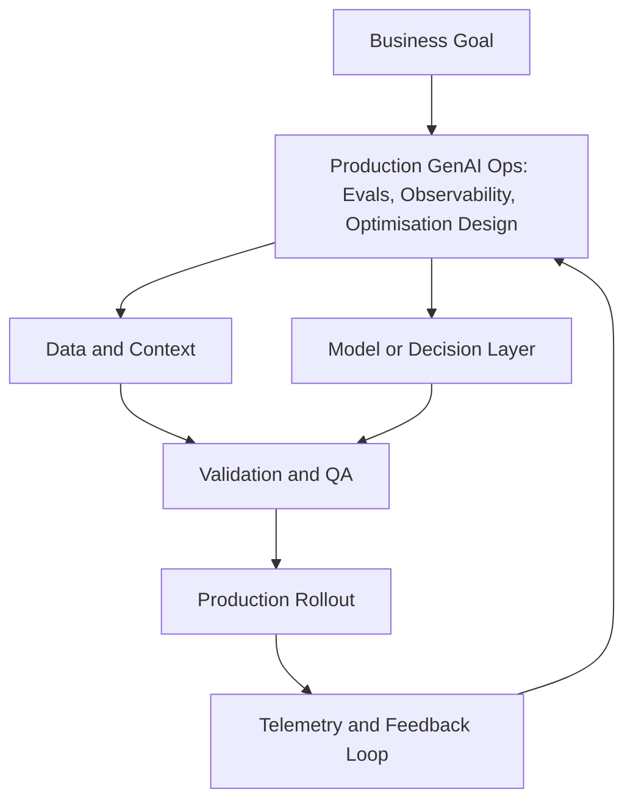

# Module 8 — Production GenAI Ops: Evals, Observability, Optimisation

## Beginner track

In this beginner pass, you will learn the operating layer that keeps GenAI systems reliable after launch.

## Why it matters

Shipping v1 is easy. Keeping quality stable under real traffic is the hard part. GenAI ops gives you the feedback loops to detect regressions, control cost, and improve safely.

## Key Concepts

### 1) Offline evals
Offline evals use a fixed “golden set” of prompts to compare model versions before release.

Track beginner metrics such as:
- correctness
- groundedness
- format compliance
- refusal quality

### 2) Online evals
Online evals run in production and use:
- user thumbs-up/down
- sampled human review
- A/B comparison

Offline tells you “safe to deploy.” Online tells you “how it performs in reality.”

### 3) Observability and tracing
Trace every request end-to-end:
- input prompt
- retrieved context
- model version
- output
- latency and token usage

This makes failures debuggable.

### 4) Latency and cost controls
Beginner optimisation levers:
- prompt compression
- response caching
- smaller model for easy requests
- timeouts and retries

### 5) Regression gates
Define release gates, for example:
- must pass 90% on golden-set correctness
- must not exceed latency budget
- must not increase cost per request beyond target

## Build Lab (Beginner)

Build a basic GenAI ops scorecard:
1. Create a 30-prompt golden set.
2. Run two model/prompt configurations.
3. Score correctness and format compliance.
4. Measure average latency and token usage.
5. Recommend one config with a short justification.

Deliverable: one-page quality/cost/latency comparison.

## Operator Case

**Scenario:** A support assistant quality dropped after a silent model update.

As operator, explain:
- which traces you inspect first
- what rollback trigger should exist
- what guardrail would have caught this earlier

## Checkpoint Quiz

See `content/quizzes/08-production-genai-ops.json`

## Tools and Further Reading
- [OpenTelemetry concepts](https://opentelemetry.io/docs/concepts/)
- [Langfuse docs](https://langfuse.com/docs)
- [Phoenix (LLM eval + tracing)](https://docs.arize.com/phoenix)

<!-- VNEXT_AUGMENTATION -->
## vNext Lesson Augmentation

### Meme opener

### Quick Recap
- Start with a business outcome and measurable success criteria.
- Design the operating workflow before selecting tools.
- Add validation, observability, and rollback controls from day one.
- Use lightweight artifacts so decisions are auditable and repeatable.

### Concept Clarity
Think of this module like building a smart kitchen. The recipe (process), ingredients (data), and tasting checks (evaluation) matter more than buying the fanciest oven. If one part fails, you need a backup plan so dinner still gets served.

### System map (mermaid)

### Harvard-style case
**Case:** Production GenAI Ops: Evals, Observability, Optimisation in a mid-market business unit.  
**Background:** Team needs faster execution without losing governance.  
**Complication:** Metrics are improving in pilots but unstable in production.  
**Analysis:** Missing control points (ownership, QA gates, and incident rules) increase variance.  
**Recommendation:** Introduce a phased operating model with explicit guardrails, then scale only when KPI and risk thresholds hold for two consecutive cycles.

### Primary references
- [NIST AI RMF](https://www.nist.gov/itl/ai-risk-management-framework)
- [Google SRE Workbook (SLOs)](https://sre.google/workbook/)
- [Harvard Business Review (Analytics & AI)](https://hbr.org/topic/analytics-and-ai)

### Downloadable artifacts
- [Module worksheet](/assets/courses/genai-ml-academy/downloads/08-production-genai-ops-worksheet.md)
- [Execution checklist (CSV)](/assets/courses/genai-ml-academy/downloads/08-production-genai-ops-checklist.csv)

### Media links
- [Module media list](/assets/courses/genai-ml-academy/videos/08-production-genai-ops-media.md)
- [MIT Sloan AI channel](https://www.youtube.com/@mitsloan)
- [Stanford HAI talks](https://www.youtube.com/@stanfordhai)

## 😄 Meme Opener

## Video Boosters
- **Quick Recap video:** [Watch](/assets/courses/genai-ml-academy/videos/08-production-genai-ops-quick-recap.mp4)
- **Concept Clarity video:** [Watch](/assets/courses/genai-ml-academy/videos/08-production-genai-ops-concept-clarity.mp4)
