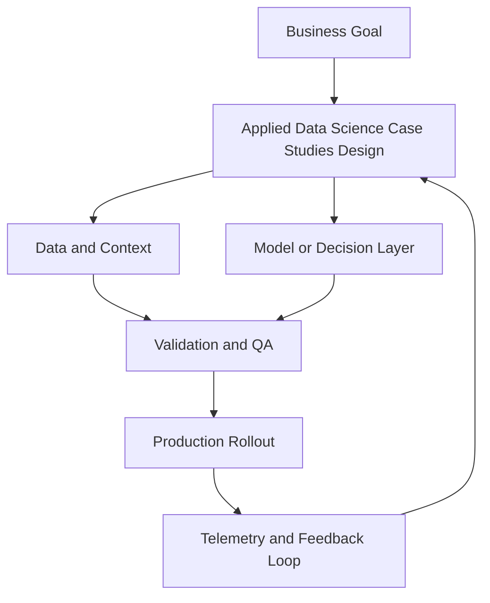

# Module 9 — Applied Data Science Case Studies

## Beginner track

In this beginner pass, you will work through practical ML case-study patterns using pandas, scikit-learn, and entry-level PyTorch.

## Why it matters

Many ML projects fail not because of model choice, but because data handling and baseline discipline are weak. This module teaches repeatable workflows you can apply to real business datasets.

## Key Concepts

### 1) Reliable data preparation with pandas
Core habits:
- inspect schema early
- handle nulls explicitly
- separate train/test before heavy transforms
- document assumptions

### 2) Baselines before complexity
Always start with a simple baseline model.
If a complex model does not beat baseline meaningfully, it is not ready.

### 3) Scikit-learn pipelines
Use `Pipeline` and `ColumnTransformer` so preprocessing and model steps stay reproducible between training and inference.

### 4) Intro PyTorch workflow
Understand the minimum loop:
- dataset and dataloader
- model definition
- loss + optimizer
- train/eval loop

### 5) Model comparison
Compare models on:
- performance metric (accuracy/F1/RMSE)
- training time
- inference cost
- interpretability

## Build Lab (Beginner)

Run a mini case study:
1. Select one public tabular dataset.
2. Build a pandas cleaning + feature prep notebook.
3. Train one scikit-learn baseline model.
4. Train one simple PyTorch MLP.
5. Compare both models in a short report.

Deliverable: notebook + comparison table.

## Operator Case

**Scenario:** Your fraud classifier has good accuracy but poor recall on fraud cases.

As operator, propose:
- better metric choice
- threshold strategy
- next experiment to improve minority-class detection

## Checkpoint Quiz

See `content/quizzes/09-applied-data-science-cases.json`

## Tools and Further Reading
- [pandas user guide](https://pandas.pydata.org/docs/user_guide/index.html)
- [scikit-learn pipeline docs](https://scikit-learn.org/stable/modules/compose.html)
- [PyTorch tutorials](https://pytorch.org/tutorials/)

<!-- VNEXT_AUGMENTATION -->
## vNext Lesson Augmentation

### Meme opener

### Quick Recap
- Start with a business outcome and measurable success criteria.
- Design the operating workflow before selecting tools.
- Add validation, observability, and rollback controls from day one.
- Use lightweight artifacts so decisions are auditable and repeatable.

### Concept Clarity
Think of this module like building a smart kitchen. The recipe (process), ingredients (data), and tasting checks (evaluation) matter more than buying the fanciest oven. If one part fails, you need a backup plan so dinner still gets served.

### System map (mermaid)

### Harvard-style case
**Case:** Applied Data Science Case Studies in a mid-market business unit.  
**Background:** Team needs faster execution without losing governance.  
**Complication:** Metrics are improving in pilots but unstable in production.  
**Analysis:** Missing control points (ownership, QA gates, and incident rules) increase variance.  
**Recommendation:** Introduce a phased operating model with explicit guardrails, then scale only when KPI and risk thresholds hold for two consecutive cycles.

### Primary references
- [NIST AI RMF](https://www.nist.gov/itl/ai-risk-management-framework)
- [Google SRE Workbook (SLOs)](https://sre.google/workbook/)
- [Harvard Business Review (Analytics & AI)](https://hbr.org/topic/analytics-and-ai)

### Downloadable artifacts
- [Module worksheet](/assets/courses/genai-ml-academy/downloads/09-applied-data-science-cases-worksheet.md)
- [Execution checklist (CSV)](/assets/courses/genai-ml-academy/downloads/09-applied-data-science-cases-checklist.csv)

### Media links
- [Module media list](/assets/courses/genai-ml-academy/videos/09-applied-data-science-cases-media.md)
- [MIT Sloan AI channel](https://www.youtube.com/@mitsloan)
- [Stanford HAI talks](https://www.youtube.com/@stanfordhai)

## 😄 Meme Opener

## Video Boosters
- **Quick Recap video:** [Watch](/assets/courses/genai-ml-academy/videos/09-applied-data-science-cases-quick-recap.mp4)
- **Concept Clarity video:** [Watch](/assets/courses/genai-ml-academy/videos/09-applied-data-science-cases-concept-clarity.mp4)
