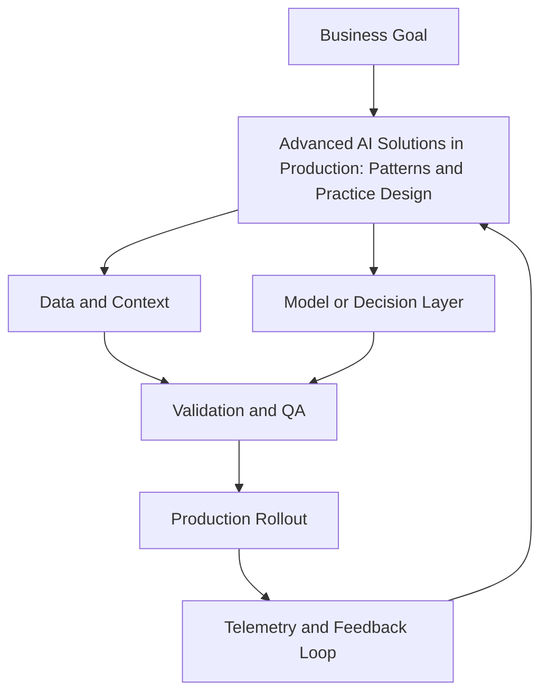

# Module 10 — Advanced AI Solutions in Production: Patterns and Practice

## Why it matters

You've learned LangChain, LangGraph, RAG, agents, and evals separately. This module is where they come together. Real production AI systems aren't single components — they're composed stacks with reliability requirements, cost constraints, security policies, and operational runbooks. This module teaches you to think like a production AI engineer, not just a prototype builder.

## Key Concepts

### Composing the stack

A production AI system typically layers:
```
User request
  → API gateway / rate limiter
  → LangChain LCEL chain (prompt + model + parser)
  → LangGraph StateGraph (orchestration, branching)
  → RAG retrieval (vector store)
  → Tool calls (APIs, databases)
  → Response streaming
  → LangSmith tracing
```

The key is **separation of concerns**: LangChain handles composition and primitives; LangGraph handles orchestration and state; RAG handles knowledge grounding; tools handle external actions.

### Agentic pipelines at scale

**Parallelism**: LangChain's `.batch()` method and LangGraph's `Send()` API enable parallel node execution. Use when subtasks are independent (e.g., research multiple topics simultaneously).

**Concurrency management**:
```python
# LangChain batch with concurrency limit
results = chain.batch(inputs, config={"max_concurrency": 5})
```

**Resource management**: every agent instance needs a context budget (max tokens), a time budget (timeout), and a cost budget (max API spend per run).

### Reliability patterns

| Pattern | Implementation | When to use |
|---|---|---|
| **Retry with backoff** | Wrap LLM calls with tenacity | Transient API errors (429, 500) |
| **Fallback chain** | `.with_fallbacks([cheaper_model])` | Primary model unavailable or too slow |
| **Graceful degradation** | Return cached response if fresh call fails | High-availability requirements |
| **Circuit breaker** | Track failure rate; stop calling failing service | Cascading failure prevention |

```python
# LangChain fallback pattern
robust_chain = primary_chain.with_fallbacks(
    [fallback_chain],
    exceptions_to_handle=(RateLimitError, APIConnectionError)
)
```

### Security and compliance

**Prompt injection defence:**
- Never interpolate untrusted user input directly into system prompts
- Validate and sanitise before injecting into the prompt context
- Use role separation: system instructions vs user content

**PII handling:**
- Detect PII before logging (use presidio or a custom regex pipeline)
- Anonymise before sending to external LLM APIs if required by policy
- Log audit trails for every AI decision with consequences

**Tool permission scoping:**
- Each agent/tool should have least-privilege access
- Dangerous tools (email, payment, database write) require human approval via LangGraph interrupt

### Deployment architectures

**Synchronous (simple tasks < 30s):**
```
FastAPI endpoint → LangChain chain → response
```

**Async task queue (long-running agents):**
```
FastAPI → Celery task → LangGraph agent → webhook callback
```

**Streaming (real-time UI):**
```
FastAPI SSE endpoint → chain.astream() → Server-Sent Events
```

**Serverless (low-frequency tasks):**
```
Cloud Function → LangChain/LangGraph agent → result stored in DB
```

### Cost management at scale

- **Token budgets**: set `max_tokens` limits per call; track cumulative spend per user/session
- **Intelligent routing**: use a small model for simple queries; route complex queries to large models
- **Semantic caching**: cache LLM responses for identical or near-identical inputs (GPTCache, Redis + embedding similarity)
- **Prompt optimisation**: trim retrieved context, use shorter system prompts; measure token efficiency per call

## Build Lab

Design and partially implement a production AI system that combines at least two of:
- LangChain LCEL chain for a specific task
- LangGraph state machine with at least one conditional branch
- RAG pipeline with a vector store
- Agent with tool use

Requirements:
1. Define the system architecture with a diagram
2. Implement the core interaction flow (can be simplified)
3. Add one reliability pattern (fallback, retry, or circuit breaker)
4. Document one security measure (input sanitisation, PII detection, or permission scoping)
5. Estimate the cost per 1000 queries and identify the biggest cost driver
6. Define the deployment architecture (sync, async, streaming, serverless)

## Operator Case

**Scenario:** A healthcare company wants to build an AI clinical decision support tool that helps doctors draft discharge summaries. It needs to: retrieve patient history (RAG on EHR data), draft a summary (LLM), flag potential drug interactions (tool call), and require physician review before finalisation. HIPAA compliance is required.

Design:
- Full system architecture
- LangGraph workflow with human-in-the-loop approval
- PII/PHI handling approach
- Deployment pattern that meets compliance and latency requirements
- Cost model and budget controls

## Checkpoint Quiz

See `content/quizzes/10-advanced-ai-solutions-in-production.json`

## Tools and Further Reading
- [LangChain production patterns](https://python.langchain.com/docs/guides/productionization/)
- [LangGraph deployment guide](https://langchain-ai.github.io/langgraph/how-tos/deploy-self-hosted/)
- [Microsoft Presidio — PII detection](https://microsoft.github.io/presidio/)
- [GPTCache — semantic caching](https://gptcache.readthedocs.io/)
- [tenacity — retry library](https://tenacity.readthedocs.io/)


<!-- VNEXT_AUGMENTATION -->
## vNext Lesson Augmentation

### Meme opener


### Quick Recap
- Start with a business outcome and measurable success criteria.
- Design the operating workflow before selecting tools.
- Add validation, observability, and rollback controls from day one.
- Use lightweight artifacts so decisions are auditable and repeatable.

### Concept Clarity
Think of this module like building a smart kitchen. The recipe (process), ingredients (data), and tasting checks (evaluation) matter more than buying the fanciest oven. If one part fails, you need a backup plan so dinner still gets served.

### System map (mermaid)


### Harvard-style case
**Case:** Advanced AI Solutions in Production: Patterns and Practice in a mid-market business unit.  
**Background:** Team needs faster execution without losing governance.  
**Complication:** Metrics are improving in pilots but unstable in production.  
**Analysis:** Missing control points (ownership, QA gates, and incident rules) increase variance.  
**Recommendation:** Introduce a phased operating model with explicit guardrails, then scale only when KPI and risk thresholds hold for two consecutive cycles.

### Primary references
- [NIST AI RMF](https://www.nist.gov/itl/ai-risk-management-framework)
- [Google SRE Workbook (SLOs)](https://sre.google/workbook/)
- [Harvard Business Review (Analytics & AI)](https://hbr.org/topic/analytics-and-ai)

### Downloadable artifacts
- [Module worksheet](/assets/courses/genai-ml-academy/downloads/10-advanced-ai-solutions-in-production-worksheet.md)
- [Execution checklist (CSV)](/assets/courses/genai-ml-academy/downloads/10-advanced-ai-solutions-in-production-checklist.csv)

### Media links
- [Module media list](/assets/courses/genai-ml-academy/videos/10-advanced-ai-solutions-in-production-media.md)
- [MIT Sloan AI channel](https://www.youtube.com/@mitsloan)
- [Stanford HAI talks](https://www.youtube.com/@stanfordhai)


## 😄 Meme Opener


## Video Boosters
- **Quick Recap video:** [Watch](/assets/courses/genai-ml-academy/videos/10-advanced-ai-solutions-in-production-quick-recap.mp4)
- **Concept Clarity video:** [Watch](/assets/courses/genai-ml-academy/videos/10-advanced-ai-solutions-in-production-concept-clarity.mp4)

---

## 🎓 Harvard-Style Case Study — Architecture fitness and over-engineering

**Context:** An enterprise deployed a multi-agent reasoning system for structured report generation. After 3 months, the team discovered that 70% of queries were simple lookups that a direct database query would handle in 50ms vs 8 seconds.

**The tension:** Move fast vs build safeguards that prevent silent quality degradation.

**Decision options:**
1. Add a query classifier to route simple lookups to a fast path
2. redesign the system with a tiered approach
3. profile all queries and optimise the most common paths first

**Discussion questions:**
1. What observable signal would have caught this before it reached production?
2. Which option gives the best risk/effort tradeoff for a small team?
3. Write a one-sentence runbook entry for this failure mode.

---

## 🤖 Solo AI Discussion Prompt

**Red Team:** "You are reviewing this Advanced AI Solutions in Production system. Assume it fails in production. Find the top 3 failure modes and propose the minimum viable fix for each."
