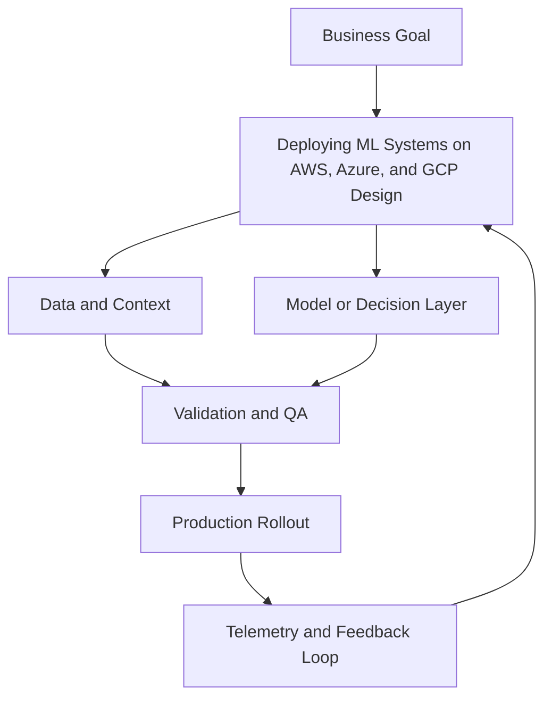

# Module 11 — Deploying ML Systems on AWS, Azure, and GCP

## Beginner track

In this beginner pass, you will learn cloud deployment patterns for ML systems and how to choose the right serving architecture.

## Why it matters

A good model in a notebook has no business value until it is deployed, monitored, and recoverable. Cloud deployment adds reliability, scalability, and operational controls.

## Key Concepts

### 1) Batch vs realtime serving
- **Batch**: scheduled predictions for many records
- **Realtime**: low-latency prediction per request

Pick based on user experience and cost constraints.

### 2) Packaging models for production
Common beginner stack:
- FastAPI service wrapper
- Docker container
- environment-locked dependencies

This gives portability across clouds.

### 3) Cloud-native options
- **AWS**: SageMaker endpoints, Lambda, Step Functions
- **Azure**: Azure ML managed endpoints, Azure Functions
- **GCP**: Vertex AI endpoints, Cloud Run

Each cloud offers both managed ML and general compute options.

### 4) CI/CD for ML
Deployment pipelines should include:
- model artifact versioning
- evaluation gate
- staged rollout (canary/shadow)
- rollback automation

### 5) Monitoring after deployment
Track:
- latency and error rate
- feature/data drift
- prediction distribution shifts
- business KPI impact

## Build Lab (Beginner)

Design a 3-cloud deployment blueprint:
1. Pick one ML use case.
2. Choose batch or realtime pattern.
3. Map an AWS, Azure, and GCP architecture.
4. Define one CI/CD gate and one rollback trigger.
5. Define a basic monitoring dashboard spec.

Deliverable: deployment decision matrix + architecture diagram.

## Operator Case

**Scenario:** Latency doubles after a model version upgrade in production.

As operator, identify:
- likely root causes
- immediate mitigation steps
- long-term guardrails to prevent recurrence

## Checkpoint Quiz

See `content/quizzes/11-ml-deployment-cloud.json`

## Tools and Further Reading
- [AWS SageMaker docs](https://docs.aws.amazon.com/sagemaker/)
- [Azure ML docs](https://learn.microsoft.com/azure/machine-learning/)
- [Vertex AI docs](https://cloud.google.com/vertex-ai/docs)

<!-- VNEXT_AUGMENTATION -->
## vNext Lesson Augmentation

### Meme opener

### Quick Recap
- Start with a business outcome and measurable success criteria.
- Design the operating workflow before selecting tools.
- Add validation, observability, and rollback controls from day one.
- Use lightweight artifacts so decisions are auditable and repeatable.

### Concept Clarity
Think of this module like building a smart kitchen. The recipe (process), ingredients (data), and tasting checks (evaluation) matter more than buying the fanciest oven. If one part fails, you need a backup plan so dinner still gets served.

### System map (mermaid)

### Harvard-style case
**Case:** Deploying ML Systems on AWS, Azure, and GCP in a mid-market business unit.  
**Background:** Team needs faster execution without losing governance.  
**Complication:** Metrics are improving in pilots but unstable in production.  
**Analysis:** Missing control points (ownership, QA gates, and incident rules) increase variance.  
**Recommendation:** Introduce a phased operating model with explicit guardrails, then scale only when KPI and risk thresholds hold for two consecutive cycles.

### Primary references
- [NIST AI RMF](https://www.nist.gov/itl/ai-risk-management-framework)
- [Google SRE Workbook (SLOs)](https://sre.google/workbook/)
- [Harvard Business Review (Analytics & AI)](https://hbr.org/topic/analytics-and-ai)

### Downloadable artifacts
- [Module worksheet](/assets/courses/genai-ml-academy/downloads/11-ml-deployment-cloud-worksheet.md)
- [Execution checklist (CSV)](/assets/courses/genai-ml-academy/downloads/11-ml-deployment-cloud-checklist.csv)

### Media links
- [Module media list](/assets/courses/genai-ml-academy/videos/11-ml-deployment-cloud-media.md)
- [MIT Sloan AI channel](https://www.youtube.com/@mitsloan)
- [Stanford HAI talks](https://www.youtube.com/@stanfordhai)

## 😄 Meme Opener

## Video Boosters
- **Quick Recap video:** [Watch](/assets/courses/genai-ml-academy/videos/11-ml-deployment-cloud-quick-recap.mp4)
- **Concept Clarity video:** [Watch](/assets/courses/genai-ml-academy/videos/11-ml-deployment-cloud-concept-clarity.mp4)

---

## 🎓 Harvard-Style Case Study — Latency vs cost tradeoffs in cloud ML deployment

**Context:** An ML team deployed a model to a serverless endpoint to save costs. Cold start latency averaged 12 seconds. Users reported the product as broken. Provisioned concurrency would have cost $200/month — less than 1 customer complaint.

**The tension:** Move fast vs build safeguards that prevent silent quality degradation.

**Decision options:**
1. Enable provisioned concurrency
2. migrate to a container endpoint
3. add a warm-up ping to keep the function warm

**Discussion questions:**
1. What observable signal would have caught this before it reached production?
2. Which option gives the best risk/effort tradeoff for a small team?
3. Write a one-sentence runbook entry for this failure mode.

---

## 🤖 Solo AI Discussion Prompt

**Red Team:** "You are reviewing this ML Deployment on AWS, Azure, and GCP system. Assume it fails in production. Find the top 3 failure modes and propose the minimum viable fix for each."
