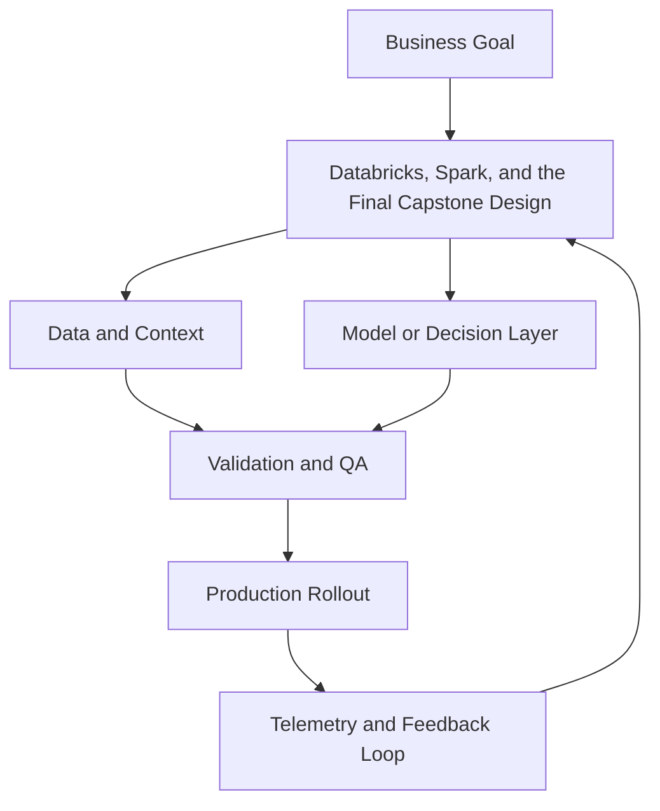

# Module 12 — Databricks, Spark, and the Final Capstone

## Beginner track

In this beginner pass, you will learn core Spark and Databricks concepts, then scope a realistic capstone project.

## Why it matters

Production AI and ML systems depend on clean, scalable data pipelines. Spark and Databricks are widely used for large-scale data engineering and model operations.

## Key Concepts

### 1) Spark DataFrames and transformations
You should be able to:
- read raw files (JSON/CSV/Parquet)
- apply filters and joins
- aggregate by business dimensions
- write transformed outputs

### 2) Lakehouse and medallion layers
A common pattern:
- **Bronze**: raw ingested data
- **Silver**: cleaned and validated data
- **Gold**: business-ready curated tables

### 3) Delta Lake basics
Delta adds:
- ACID transactions
- schema enforcement
- time travel/versioning

This improves reliability of analytics and ML training inputs.

### 4) Databricks workspace fundamentals
Core platform capabilities:
- notebooks and jobs/workflows
- Unity Catalog governance
- MLflow experiment tracking

### 5) Capstone framing
A strong capstone has:
- clear business question
- measurable success metric
- scoped timeline
- data + model + deployment story

## Build Lab (Beginner)

Create a starter Spark + capstone package:
1. Build a Spark job: raw JSON -> cleaned Silver table.
2. Add one quality check (null threshold or schema check).
3. Save outputs in Delta format.
4. Draft capstone brief with objective, dataset, and metric.
5. Define milestone plan (week-by-week).

Deliverable: Spark notebook/script + capstone brief.

## Operator Case

**Scenario:** Your weekly pipeline succeeds, but downstream dashboard numbers keep changing unexpectedly.

As operator, explain:
- which Delta/Spark checks to add
- how medallion layering reduces this issue
- what data contract to enforce before Gold outputs

## Checkpoint Quiz

See `content/quizzes/12-databricks-spark-capstone.json`

## Tools and Further Reading
- [Apache Spark SQL guide](https://spark.apache.org/docs/latest/sql-programming-guide.html)
- [Delta Lake docs](https://docs.delta.io/latest/index.html)
- [Databricks docs](https://docs.databricks.com/)

<!-- VNEXT_AUGMENTATION -->
## vNext Lesson Augmentation

### Meme opener

### Quick Recap
- Start with a business outcome and measurable success criteria.
- Design the operating workflow before selecting tools.
- Add validation, observability, and rollback controls from day one.
- Use lightweight artifacts so decisions are auditable and repeatable.

### Concept Clarity
Think of this module like building a smart kitchen. The recipe (process), ingredients (data), and tasting checks (evaluation) matter more than buying the fanciest oven. If one part fails, you need a backup plan so dinner still gets served.

### System map (mermaid)

### Harvard-style case
**Case:** Databricks, Spark, and the Final Capstone in a mid-market business unit.  
**Background:** Team needs faster execution without losing governance.  
**Complication:** Metrics are improving in pilots but unstable in production.  
**Analysis:** Missing control points (ownership, QA gates, and incident rules) increase variance.  
**Recommendation:** Introduce a phased operating model with explicit guardrails, then scale only when KPI and risk thresholds hold for two consecutive cycles.

### Primary references
- [NIST AI RMF](https://www.nist.gov/itl/ai-risk-management-framework)
- [Google SRE Workbook (SLOs)](https://sre.google/workbook/)
- [Harvard Business Review (Analytics & AI)](https://hbr.org/topic/analytics-and-ai)

### Downloadable artifacts
- [Module worksheet](/assets/courses/genai-ml-academy/downloads/12-databricks-spark-capstone-worksheet.md)
- [Execution checklist (CSV)](/assets/courses/genai-ml-academy/downloads/12-databricks-spark-capstone-checklist.csv)

### Media links
- [Module media list](/assets/courses/genai-ml-academy/videos/12-databricks-spark-capstone-media.md)
- [MIT Sloan AI channel](https://www.youtube.com/@mitsloan)
- [Stanford HAI talks](https://www.youtube.com/@stanfordhai)

## 😄 Meme Opener

## Video Boosters
- **Quick Recap video:** [Watch](/assets/courses/genai-ml-academy/videos/12-databricks-spark-capstone-quick-recap.mp4)
- **Concept Clarity video:** [Watch](/assets/courses/genai-ml-academy/videos/12-databricks-spark-capstone-concept-clarity.mp4)

---

## 🎓 Harvard-Style Case Study — Data quality gates in ML pipelines

**Context:** A Databricks ML pipeline ran daily feature computation jobs. A schema change in an upstream table silently produced null features for 30% of rows. The model continued scoring — with degraded accuracy — for two weeks.

**The tension:** Move fast vs build safeguards that prevent silent quality degradation.

**Decision options:**
1. Add schema validation checks at the ingestion stage
2. add data quality assertions at the feature computation stage
3. add a model quality monitor that triggers on feature drift

**Discussion questions:**
1. What observable signal would have caught this before it reached production?
2. Which option gives the best risk/effort tradeoff for a small team?
3. Write a one-sentence runbook entry for this failure mode.

---

## 🤖 Solo AI Discussion Prompt

**Red Team:** "You are reviewing this Databricks, Spark, and Capstone system. Assume it fails in production. Find the top 3 failure modes and propose the minimum viable fix for each."
