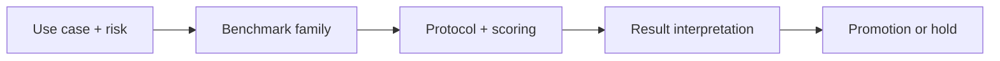

## 😄 Meme Opener

> *"We measured the model. We just don't know what we measured."*

# Benchmarking First Principles: Core Concepts

## Quick Recap
- Benchmarks are decision instruments, not vanity scoreboards.
- Validity means the benchmark actually measures the capability you care about.
- Reliability means repeated runs and evaluators produce stable conclusions.

## Concept Clarity
First-principles benchmarking starts with deployment risk, then works backwards to measurement design. If your model will write customer-facing support answers, your benchmark portfolio should punish hallucination and instruction drift, not just reward trivia recall.

## Mermaid Visual

## Applied Case
A support copiloting team promoted a model because it led on a public benchmark. Live deployment spiked escalations because the benchmark underweighted policy adherence and abstention behavior. Rebuilding the eval stack around real ticket constraints reduced escalation rate by 27%.

## Practical Application Checklist
1. Define the deployment decision this benchmark should influence.
2. State one blind spot this benchmark will not cover.
3. Pair with at least one complementary benchmark family.
4. Record thresholds and rollback conditions before comparing candidates.

## Primary References
- https://arxiv.org/abs/2404.18824
- https://www.anthropic.com/research/forecasting-rare-behaviors

## Anti-Pattern to Avoid
Optimizing leaderboard rank before defining business-critical failure costs.

---

## 🎓 Harvard-Style Case Study — Benchmark Selection and Use-Case Alignment

**Context:** A product team shipped an LLM feature after evaluating only on MMLU. In production, the model failed on their actual use case — instruction following. MMLU never tested that.

**The tension:** Use the most popular benchmark vs invest in use-case-specific evaluation before shipping.

**Decision options:**
1. Add use-case-specific evals before any production deployment
2. Add a secondary benchmark that tests instruction following (IFEval)
3. Build a golden set from real user queries and use that as the primary gate

**Discussion questions:**
1. What observable signal would have caught this before it reached production users?
2. Which option gives the best coverage/effort tradeoff for a 2-engineer team?
3. Write a one-sentence eval gate rule that would prevent this specific failure mode.

---

## 🤖 Solo AI Discussion Prompt

**Red Team:** "You are reviewing this benchmark strategy. Assume it will miss a real failure in production. Describe the top 2 failure modes it won't catch and how you'd close those gaps."
