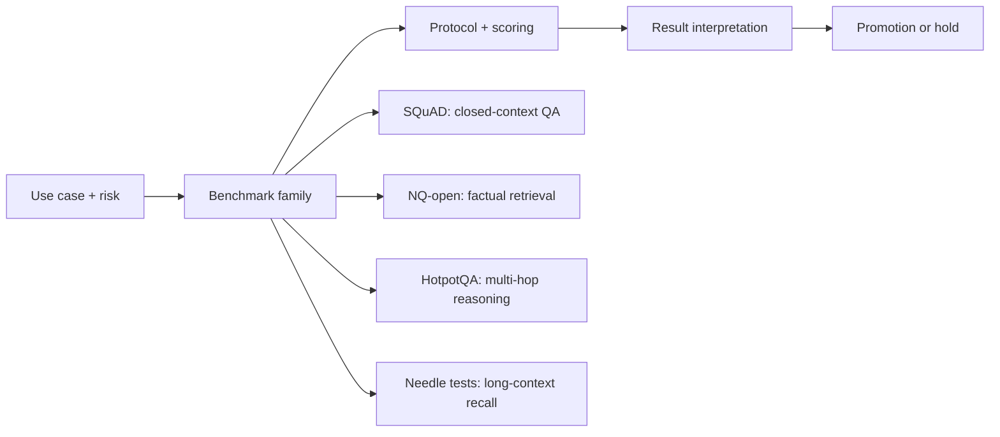

# Benchmark Architecture and Metric Design: Core Concepts

## Quick Recap
- Architecture choices determine the meaning of every final score.
- Retrieval QA, multi-hop QA, and long-context recall should be treated as separate benchmark families.
- Metric design should encode error severity, not only answer match.

## Concept Clarity
Every benchmark has four layers: task design, evaluation protocol, scoring function, and aggregation. Teams often debate only model results while ignoring that protocol and scoring choices may dominate variance.

For this course, four additional benchmark families matter:
- **SQuAD**: span-extraction reading comprehension in a provided passage (strong baseline for closed-context QA)
- **NQ-open**: open-domain factual retrieval QA (can your system find the right fact at all?)
- **HotpotQA**: multi-hop reasoning QA (can it combine evidence across multiple passages?)
- **Long-context needle tests**: context utilization and retrieval position robustness (can it reliably recover a key fact buried in long context?)

## Mermaid Visual

## Applied Case
A team looked strong on SQuAD-style closed-context QA but failed production tasks requiring retrieval, cross-document synthesis, and long-context grounding. Adding NQ-open, HotpotQA, and long-context needle slices revealed the true bottleneck: retrieval and context usage, not core model fluency.

## Practical Application Checklist
1. Define which user-critical failure each benchmark family should catch.
2. Separate retrieval, reasoning, and long-context recall in score reporting.
3. Use family-specific thresholds (not one blended number only).
4. Record protocol settings (context length, retrieval depth, judge rubric) for comparability.

## Primary References
- https://arxiv.org/abs/1606.05250
- https://aclanthology.org/Q19-1026/
- https://aclanthology.org/D18-1259/
- https://arxiv.org/abs/2307.03172

## Anti-Pattern to Avoid
Treating long-context ability as “already covered” by short-context QA benchmarks.
