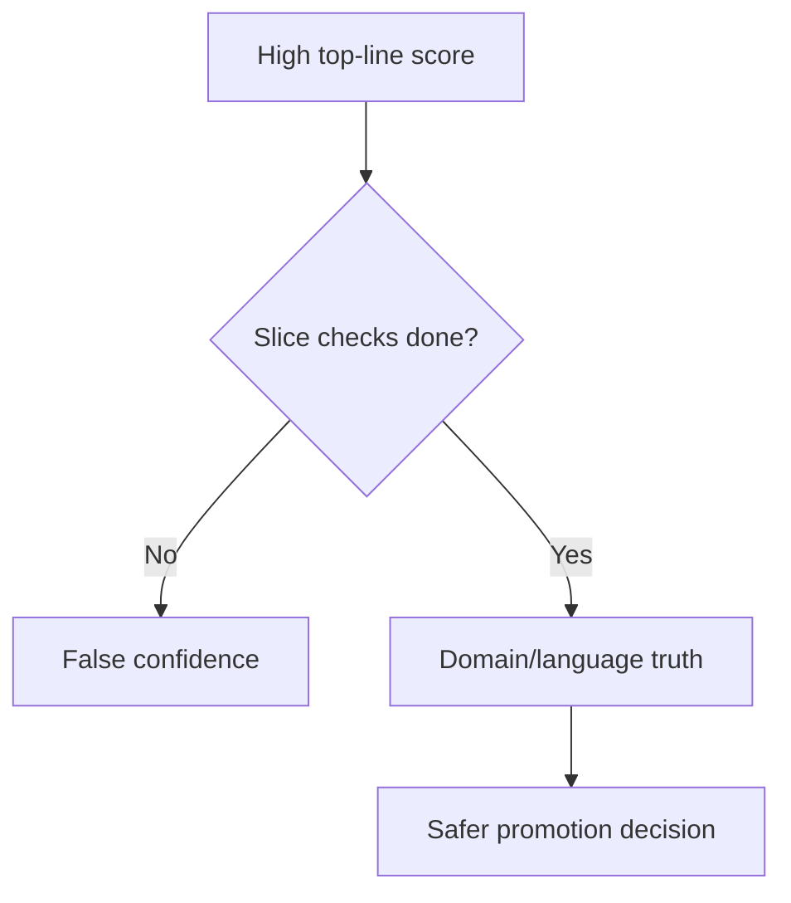

## 😄 Meme Opener

> *"MMLU score: 89%. Can it answer a support ticket? Different question."*

# MMLU/MMMLU Pitfalls and Case Review

## Quick Recap
- Beware over-indexing on single aggregate scores.
- Language transfer quality can break under production phrasing.
- Governance needs slice-level red lines.

## Concept Clarity
Most MMLU/MMMLU failures come from interpretation, not execution:
- treating broad knowledge as product quality
- skipping subject/language breakdowns
- ignoring confidence intervals for close model comparisons

## Mermaid Visual

## Applied Case
A support assistant gained +3 top-line MMLU but dropped on healthcare policy questions. Slice-level review caught the regression and forced model hold until remediation.

## Practical Application Checklist
1. Always compare confidence intervals, not just point estimates.
2. Add language-specific QA samples beyond benchmark prompts.
3. Block promotion on red-line slice failures.
4. Keep historical slice trends for drift detection.

## Primary References
- https://arxiv.org/abs/2009.03300
- https://arxiv.org/abs/2304.12986

---

## 🎓 Harvard-Style Case Study — Multi-benchmark strategy and task-specific evaluation

**Context:** A team used MMLU as their primary eval for a customer support LLM. The model scored 89%. It consistently mishandled ambiguous customer requests — a pattern MMLU's multiple-choice format never surfaces.

**The tension:** Ship fast vs build evaluation infrastructure that catches real failures before users do.

**Decision options:**
1. Add an open-ended response quality eval
2. add real support ticket samples to the eval set
3. benchmark on MMLU + a task-specific eval together

**Discussion questions:**
1. What observable signal would have caught this issue before it reached production users?
2. Which option gives the best coverage/effort tradeoff for a 2-engineer team?
3. Write a one-sentence eval gate rule that would prevent this specific failure mode.

---

## 🤖 Solo AI Discussion Prompt

**Red Team:** "You are reviewing this eval strategy. Assume it will miss a real failure in production. Describe the top 2 failure modes it won't catch and how you'd close those gaps."

**Socratic Coach:** "Ask me one question at a time about this benchmark decision. Force me to justify each choice with evidence. After 6 questions, tell me what I'm missing."
