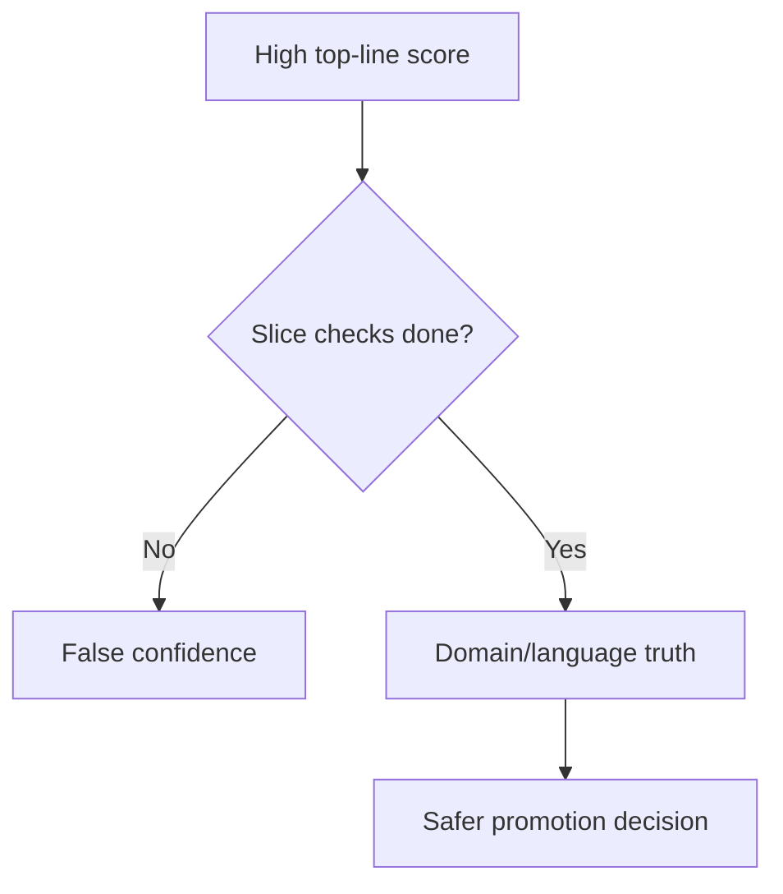

# MMLU/MMMLU Pitfalls and Case Review

## Quick Recap
- Beware over-indexing on single aggregate scores.
- Language transfer quality can break under production phrasing.
- Governance needs slice-level red lines.

## Concept Clarity
Most MMLU/MMMLU failures come from interpretation, not execution:
- treating broad knowledge as product quality
- skipping subject/language breakdowns
- ignoring confidence intervals for close model comparisons

## Mermaid Visual

## Applied Case
A support assistant gained +3 top-line MMLU but dropped on healthcare policy questions. Slice-level review caught the regression and forced model hold until remediation.

## Practical Application Checklist
1. Always compare confidence intervals, not just point estimates.
2. Add language-specific QA samples beyond benchmark prompts.
3. Block promotion on red-line slice failures.
4. Keep historical slice trends for drift detection.

## Primary References
- https://arxiv.org/abs/2009.03300
- https://arxiv.org/abs/2304.12986
