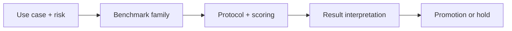

## 😄 Meme Opener

> *"The model passed a PhD-level benchmark. It still can't count the letters in 'strawberry'."*

# GPQA and Humanity's Last Exam: Core Concepts

## Quick Recap
- GPQA is engineered to be hard even for strong retrieval-based systems.
- Humanity's Last Exam explores frontier-level capability ceilings over difficult tasks.
- Hard benchmarks are excellent stress tests but weak as sole operational gates.

## Concept Clarity
GPQA-style tasks reduce reward from shallow memorization and search shortcuts, surfacing deeper reasoning limits. Humanity's Last Exam pushes this frontier logic wider, helping teams observe where state-of-the-art systems still fail systematically.

## Mermaid Visual

## Applied Case
A lab tuned for easier math and coding leaderboards saw no GPQA gain. Product teams wrongly assumed broad reasoning had improved. Adding GPQA/HLE into release criteria prevented a high-stakes domain assistant rollout that would have over-promised expert reliability.

## Practical Application Checklist
1. Define the deployment decision this benchmark should influence.
2. State one blind spot this benchmark will not cover.
3. Pair with at least one complementary benchmark family.
4. Record thresholds and rollback conditions before comparing candidates.

## Primary References
- https://arxiv.org/abs/2311.12022
- https://agi.safe.ai/

## Anti-Pattern to Avoid
Assuming frontier-hard gains directly translate to everyday product UX improvements.

---

## 🎓 Harvard-Style Case Study — Benchmark coverage gaps and capability decomposition

**Context:** A frontier model scored in the 80th percentile on GPQA. A customer demo failed when the model made a basic arithmetic error. The team had no eval for numerical reasoning.

**The tension:** Ship fast vs build evaluation infrastructure that catches real failures before users do.

**Decision options:**
1. Add a numerical reasoning benchmark to the eval suite
2. add a regression test for basic arithmetic
3. accept that GPQA does not cover all capability dimensions

**Discussion questions:**
1. What observable signal would have caught this issue before it reached production users?
2. Which option gives the best coverage/effort tradeoff for a 2-engineer team?
3. Write a one-sentence eval gate rule that would prevent this specific failure mode.

---

## 🤖 Solo AI Discussion Prompt

**Red Team:** "You are reviewing this eval strategy. Assume it will miss a real failure in production. Describe the top 2 failure modes it won't catch and how you'd close those gaps."

**Socratic Coach:** "Ask me one question at a time about this benchmark decision. Force me to justify each choice with evidence. After 6 questions, tell me what I'm missing."
