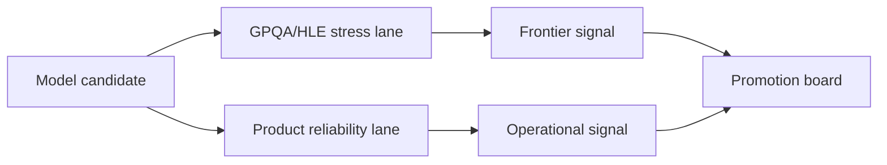

# Frontier-Hard Eval Operations (GPQA/HLE)

## Quick Recap
- GPQA/HLE are useful for stress-testing reasoning limits.
- They are expensive signals and need careful interpretation.
- Operational value comes from combining them with product-grounded metrics.

## Concept Clarity
Run GPQA/HLE in a **frontier lane** of your eval stack:
1. Weekly or pre-release stress checks.
2. Strict manifest/version controls.
3. Decision memo tying gains to product relevance.

## Mermaid Visual

## Applied Case
A model improved on GPQA but regressed on tool-call correctness and instruction adherence. Governance policy prevented promotion because practical reliability lane failed despite frontier gains.

## Practical Application Checklist
1. Set explicit role of GPQA/HLE in decision policy.
2. Use confidence bands for comparisons on small effective samples.
3. Pair with at least two operational benchmark families.
4. Document why hard-benchmark deltas matter (or do not) for your product.

## Primary References
- https://arxiv.org/abs/2311.12022
- https://lastexam.ai/
