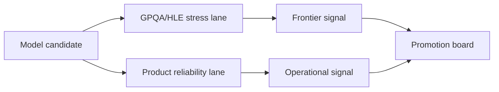

## 😄 Meme Opener

> *"The model passed a PhD-level benchmark. It still can't count the letters in 'strawberry'."*

# Frontier-Hard Eval Operations (GPQA/HLE)

## Quick Recap
- GPQA/HLE are useful for stress-testing reasoning limits.
- They are expensive signals and need careful interpretation.
- Operational value comes from combining them with product-grounded metrics.

## Concept Clarity
Run GPQA/HLE in a **frontier lane** of your eval stack:
1. Weekly or pre-release stress checks.
2. Strict manifest/version controls.
3. Decision memo tying gains to product relevance.

## Mermaid Visual

## Applied Case
A model improved on GPQA but regressed on tool-call correctness and instruction adherence. Governance policy prevented promotion because practical reliability lane failed despite frontier gains.

## Practical Application Checklist
1. Set explicit role of GPQA/HLE in decision policy.
2. Use confidence bands for comparisons on small effective samples.
3. Pair with at least two operational benchmark families.
4. Document why hard-benchmark deltas matter (or do not) for your product.

## Primary References
- https://arxiv.org/abs/2311.12022
- https://lastexam.ai/

---

## 🎓 Harvard-Style Case Study — Benchmark coverage gaps and capability decomposition

**Context:** A frontier model scored in the 80th percentile on GPQA. A customer demo failed when the model made a basic arithmetic error. The team had no eval for numerical reasoning.

**The tension:** Ship fast vs build evaluation infrastructure that catches real failures before users do.

**Decision options:**
1. Add a numerical reasoning benchmark to the eval suite
2. add a regression test for basic arithmetic
3. accept that GPQA does not cover all capability dimensions

**Discussion questions:**
1. What observable signal would have caught this issue before it reached production users?
2. Which option gives the best coverage/effort tradeoff for a 2-engineer team?
3. Write a one-sentence eval gate rule that would prevent this specific failure mode.

---

## 🤖 Solo AI Discussion Prompt

**Red Team:** "You are reviewing this eval strategy. Assume it will miss a real failure in production. Describe the top 2 failure modes it won't catch and how you'd close those gaps."

**Socratic Coach:** "Ask me one question at a time about this benchmark decision. Force me to justify each choice with evidence. After 6 questions, tell me what I'm missing."
