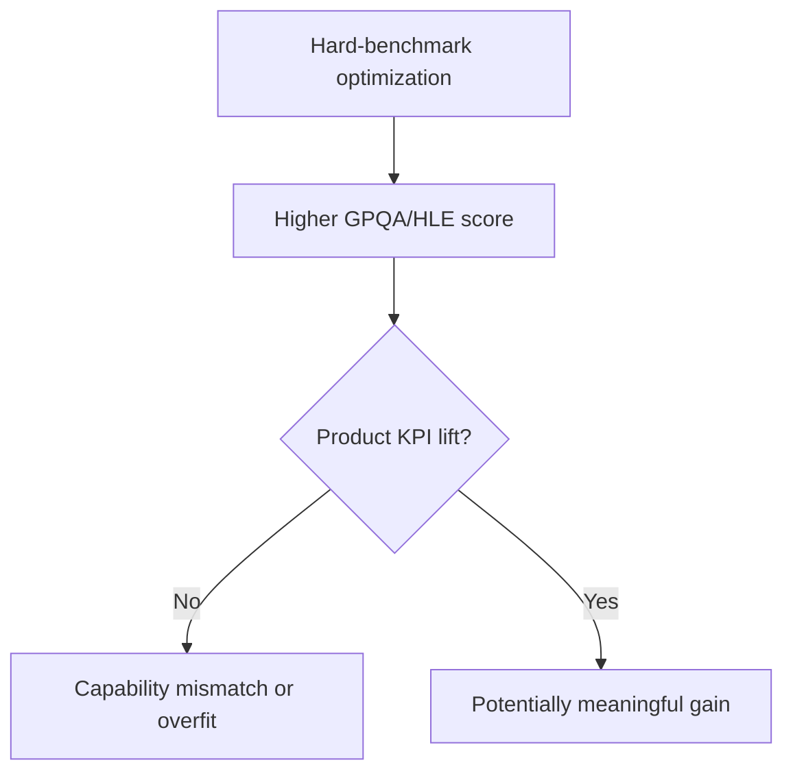

# Overfitting Risk in Hard Benchmarks

## Quick Recap
- Hard benchmarks are valuable but easy to misapply.
- If product KPIs stay flat, score gains may be mismatched to deployment tasks.
- Require counterfactual evidence before promotion.

## Concept Clarity
Overfitting patterns include:
- benchmark-specific prompt tuning that does not transfer
- selective reporting of favorable runs
- underweighting practical task reliability

## Mermaid Visual

## Applied Case
A team promoted a model after strong HLE movement. Shadow traffic showed higher refusal instability in customer workflows. Postmortem found optimization targeted benchmark style, not user task mix.

## Practical Application Checklist
1. Require shadow/holdout KPI evidence with benchmark gains.
2. Publish run selection policy (avoid best-of-N opacity).
3. Keep rollback triggers for practical regressions.
4. Log reasoning benchmark deltas alongside user impact metrics.

## Primary References
- https://arxiv.org/abs/2405.00332
- https://lastexam.ai/
