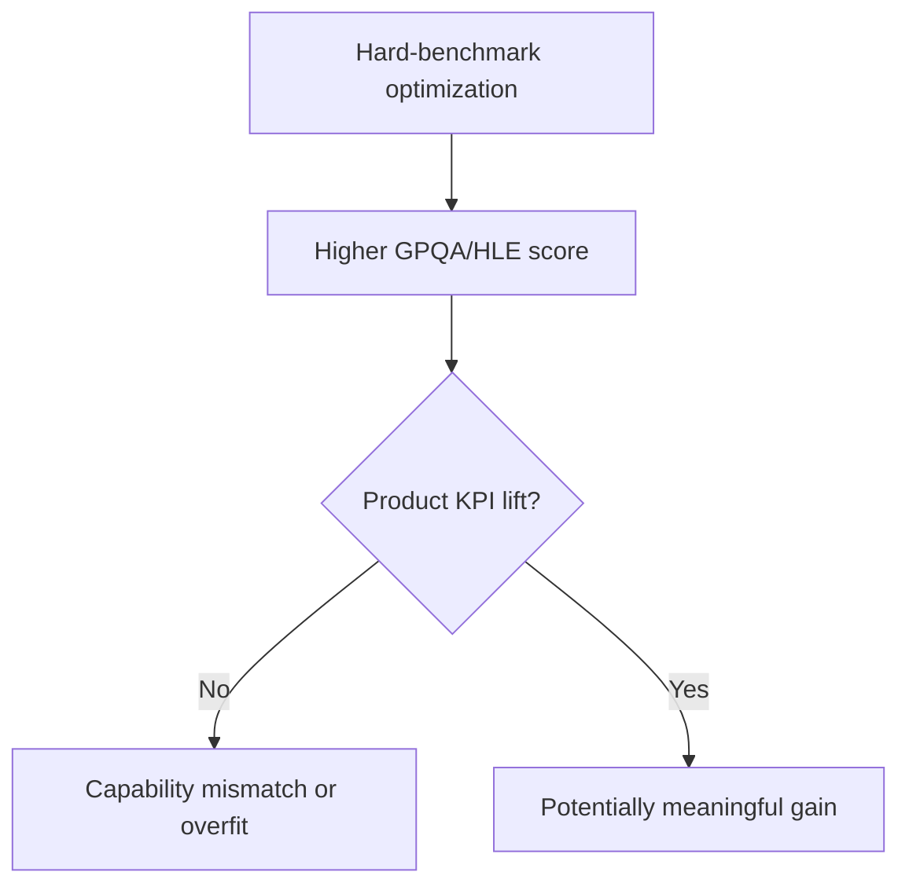

## 😄 Meme Opener

> *"The model passed a PhD-level benchmark. It still can't count the letters in 'strawberry'."*

# Overfitting Risk in Hard Benchmarks

## Quick Recap
- Hard benchmarks are valuable but easy to misapply.
- If product KPIs stay flat, score gains may be mismatched to deployment tasks.
- Require counterfactual evidence before promotion.

## Concept Clarity
Overfitting patterns include:
- benchmark-specific prompt tuning that does not transfer
- selective reporting of favorable runs
- underweighting practical task reliability

## Mermaid Visual

## Applied Case
A team promoted a model after strong HLE movement. Shadow traffic showed higher refusal instability in customer workflows. Postmortem found optimization targeted benchmark style, not user task mix.

## Practical Application Checklist
1. Require shadow/holdout KPI evidence with benchmark gains.
2. Publish run selection policy (avoid best-of-N opacity).
3. Keep rollback triggers for practical regressions.
4. Log reasoning benchmark deltas alongside user impact metrics.

## Primary References
- https://arxiv.org/abs/2405.00332
- https://lastexam.ai/

---

## 🎓 Harvard-Style Case Study — Benchmark coverage gaps and capability decomposition

**Context:** A frontier model scored in the 80th percentile on GPQA. A customer demo failed when the model made a basic arithmetic error. The team had no eval for numerical reasoning.

**The tension:** Ship fast vs build evaluation infrastructure that catches real failures before users do.

**Decision options:**
1. Add a numerical reasoning benchmark to the eval suite
2. add a regression test for basic arithmetic
3. accept that GPQA does not cover all capability dimensions

**Discussion questions:**
1. What observable signal would have caught this issue before it reached production users?
2. Which option gives the best coverage/effort tradeoff for a 2-engineer team?
3. Write a one-sentence eval gate rule that would prevent this specific failure mode.

---

## 🤖 Solo AI Discussion Prompt

**Red Team:** "You are reviewing this eval strategy. Assume it will miss a real failure in production. Describe the top 2 failure modes it won't catch and how you'd close those gaps."

**Socratic Coach:** "Ask me one question at a time about this benchmark decision. Force me to justify each choice with evidence. After 6 questions, tell me what I'm missing."
