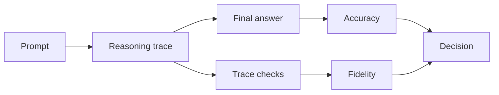

## 😄 Meme Opener

> *"The model solved 8-step math problems. It got the tip calculation wrong at dinner."*

# Reasoning-Trace Evaluation for GSM8K/MGSM

## Quick Recap
- Correct answers are not enough for deployment confidence.
- Evaluate intermediate reasoning quality and consistency.
- Compare error classes across languages.

## Concept Clarity
For GSM8K/MGSM, track three layers:
1. Final answer correctness.
2. Step consistency and arithmetic validity.
3. Cross-language robustness of reasoning behavior.

## Mermaid Visual

## Applied Case
A model maintained strong final-answer rates but produced inconsistent intermediate steps in Spanish prompts. A trace-quality gate exposed the issue before launch in LATAM.

## Practical Application Checklist
1. Add trace-level validators for arithmetic consistency.
2. Slice errors by language and question type.
3. Track “correct answer, bad reasoning” frequency.
4. Require minimum fidelity threshold for high-risk use cases.

## Primary References
- https://arxiv.org/abs/2110.14168
- https://arxiv.org/abs/2210.03057

---

## 🎓 Harvard-Style Case Study — Multilingual eval coverage and market readiness

**Context:** A multilingual product team evaluated their model on GSM8K (English only) and shipped to 12 markets. In 3 non-English markets, math reasoning degraded significantly. MGSM scores for those languages were never checked.

**The tension:** Ship fast vs build evaluation infrastructure that catches real failures before users do.

**Decision options:**
1. Add MGSM coverage for all target languages before shipping
2. add a language-specific regression gate
3. require MGSM parity within 5 points of English baseline

**Discussion questions:**
1. What observable signal would have caught this issue before it reached production users?
2. Which option gives the best coverage/effort tradeoff for a 2-engineer team?
3. Write a one-sentence eval gate rule that would prevent this specific failure mode.

---

## 🤖 Solo AI Discussion Prompt

**Red Team:** "You are reviewing this eval strategy. Assume it will miss a real failure in production. Describe the top 2 failure modes it won't catch and how you'd close those gaps."

**Socratic Coach:** "Ask me one question at a time about this benchmark decision. Force me to justify each choice with evidence. After 6 questions, tell me what I'm missing."
