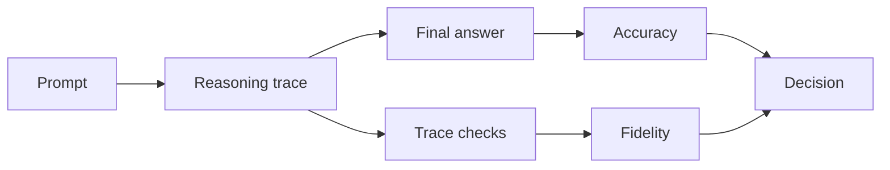

# Reasoning-Trace Evaluation for GSM8K/MGSM

## Quick Recap
- Correct answers are not enough for deployment confidence.
- Evaluate intermediate reasoning quality and consistency.
- Compare error classes across languages.

## Concept Clarity
For GSM8K/MGSM, track three layers:
1. Final answer correctness.
2. Step consistency and arithmetic validity.
3. Cross-language robustness of reasoning behavior.

## Mermaid Visual

## Applied Case
A model maintained strong final-answer rates but produced inconsistent intermediate steps in Spanish prompts. A trace-quality gate exposed the issue before launch in LATAM.

## Practical Application Checklist
1. Add trace-level validators for arithmetic consistency.
2. Slice errors by language and question type.
3. Track “correct answer, bad reasoning” frequency.
4. Require minimum fidelity threshold for high-risk use cases.

## Primary References
- https://arxiv.org/abs/2110.14168
- https://arxiv.org/abs/2210.03057
