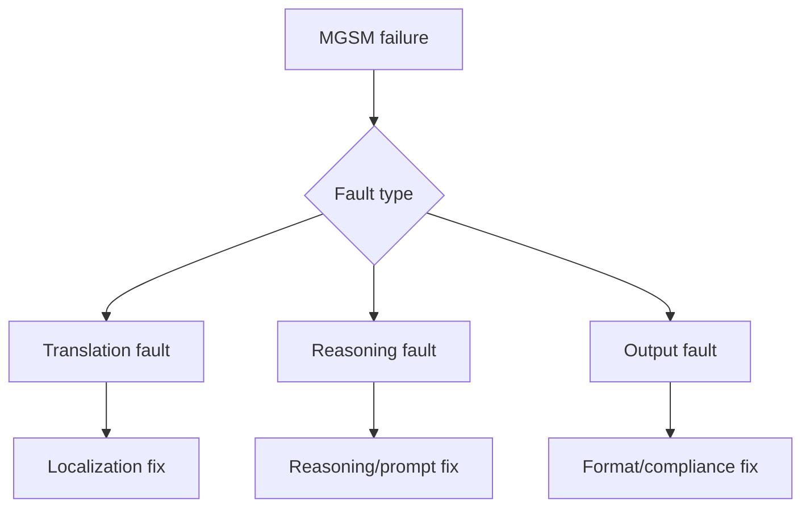

## 😄 Meme Opener

> *"The model solved 8-step math problems. It got the tip calculation wrong at dinner."*

# Multilingual Regression Playbook (GSM8K/MGSM)

## Quick Recap
- Strong English math performance does not guarantee multilingual reliability.
- Regression triage needs a clear taxonomy.
- Fixes should be verified with targeted re-runs, not only full-suite averages.

## Concept Clarity
Use a triage tree:
- **Translation fault**: prompt meaning changed.
- **Reasoning fault**: logic/arithmetic failed.
- **Output fault**: answer format/parsing failed.

## Mermaid Visual

## Applied Case
A model regressed in Indonesian MGSM while maintaining English performance. Triage showed mostly translation ambiguity, so prompt localization and glossary alignment fixed most failures without model swap.

## Practical Application Checklist
1. Track multilingual metrics per target market language.
2. Label at least 30 failures before remediation.
3. Re-run targeted slices after each fix.
4. Enforce language-specific red lines for rollout.

## Primary References
- https://arxiv.org/abs/2210.03057
- https://arxiv.org/abs/2110.14168

---

## 🎓 Harvard-Style Case Study — Multilingual eval coverage and market readiness

**Context:** A multilingual product team evaluated their model on GSM8K (English only) and shipped to 12 markets. In 3 non-English markets, math reasoning degraded significantly. MGSM scores for those languages were never checked.

**The tension:** Ship fast vs build evaluation infrastructure that catches real failures before users do.

**Decision options:**
1. Add MGSM coverage for all target languages before shipping
2. add a language-specific regression gate
3. require MGSM parity within 5 points of English baseline

**Discussion questions:**
1. What observable signal would have caught this issue before it reached production users?
2. Which option gives the best coverage/effort tradeoff for a 2-engineer team?
3. Write a one-sentence eval gate rule that would prevent this specific failure mode.

---

## 🤖 Solo AI Discussion Prompt

**Red Team:** "You are reviewing this eval strategy. Assume it will miss a real failure in production. Describe the top 2 failure modes it won't catch and how you'd close those gaps."

**Socratic Coach:** "Ask me one question at a time about this benchmark decision. Force me to justify each choice with evidence. After 6 questions, tell me what I'm missing."
