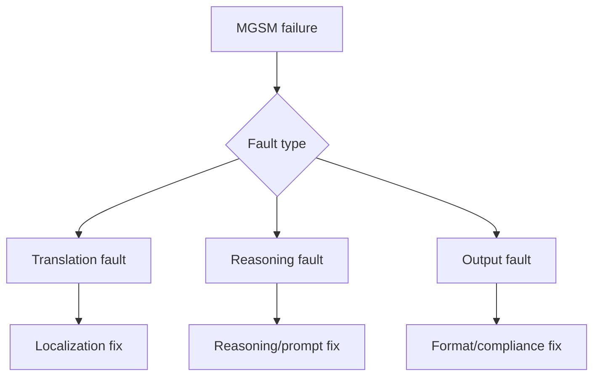

# Multilingual Regression Playbook (GSM8K/MGSM)

## Quick Recap
- Strong English math performance does not guarantee multilingual reliability.
- Regression triage needs a clear taxonomy.
- Fixes should be verified with targeted re-runs, not only full-suite averages.

## Concept Clarity
Use a triage tree:
- **Translation fault**: prompt meaning changed.
- **Reasoning fault**: logic/arithmetic failed.
- **Output fault**: answer format/parsing failed.

## Mermaid Visual

## Applied Case
A model regressed in Indonesian MGSM while maintaining English performance. Triage showed mostly translation ambiguity, so prompt localization and glossary alignment fixed most failures without model swap.

## Practical Application Checklist
1. Track multilingual metrics per target market language.
2. Label at least 30 failures before remediation.
3. Re-run targeted slices after each fix.
4. Enforce language-specific red lines for rollout.

## Primary References
- https://arxiv.org/abs/2210.03057
- https://arxiv.org/abs/2110.14168
