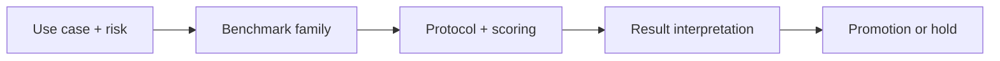

## 😄 Meme Opener

> *"Output format: JSON. Actual output: JSON with a paragraph of explanation before and after."*

# IFEval and IFBench for Instruction Following: Core Concepts

## Quick Recap
- IFEval checks whether models follow explicit constraints in prompts.
- IFBench-style suites stress multi-constraint and format-faithful execution.
- Instruction adherence is often the missing metric in high-score benchmark stacks.

## Concept Clarity
Many production failures are not “knowledge” failures but execution failures, where the model knows the answer yet violates format, policy, or scope constraints. IFEval and IFBench-like tests target this gap directly.

## Mermaid Visual

## Applied Case
An enterprise writing assistant had strong factual scores but repeatedly violated “JSON only” output contracts. Adding instruction-following benchmarks before promotion cut downstream parser failures by more than half.

## Practical Application Checklist
1. Define the deployment decision this benchmark should influence.
2. State one blind spot this benchmark will not cover.
3. Pair with at least one complementary benchmark family.
4. Record thresholds and rollback conditions before comparing candidates.

## Primary References
- https://arxiv.org/abs/2311.07911
- https://github.com/stanford-crfm/helm

## Anti-Pattern to Avoid
Using only semantic answer quality metrics for structured-output products.

---

## 🎓 Harvard-Style Case Study — Instruction following as a first-class eval dimension

**Context:** A team built an agent that required strictly formatted JSON output. The model scored 91% on general benchmarks. In production, it added prose before and after JSON in 30% of responses — breaking the downstream parser.

**The tension:** Ship fast vs build evaluation infrastructure that catches real failures before users do.

**Decision options:**
1. Add IFEval as a release gate for instruction-following
2. add output schema validation as a hard gate
3. add a post-processing step to strip non-JSON content

**Discussion questions:**
1. What observable signal would have caught this issue before it reached production users?
2. Which option gives the best coverage/effort tradeoff for a 2-engineer team?
3. Write a one-sentence eval gate rule that would prevent this specific failure mode.

---

## 🤖 Solo AI Discussion Prompt

**Red Team:** "You are reviewing this eval strategy. Assume it will miss a real failure in production. Describe the top 2 failure modes it won't catch and how you'd close those gaps."

**Socratic Coach:** "Ask me one question at a time about this benchmark decision. Force me to justify each choice with evidence. After 6 questions, tell me what I'm missing."
