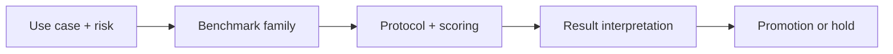

# IFEval and IFBench for Instruction Following: Core Concepts

## Quick Recap
- IFEval checks whether models follow explicit constraints in prompts.
- IFBench-style suites stress multi-constraint and format-faithful execution.
- Instruction adherence is often the missing metric in high-score benchmark stacks.

## Concept Clarity
Many production failures are not “knowledge” failures but execution failures, where the model knows the answer yet violates format, policy, or scope constraints. IFEval and IFBench-like tests target this gap directly.

## Mermaid Visual

## Applied Case
An enterprise writing assistant had strong factual scores but repeatedly violated “JSON only” output contracts. Adding instruction-following benchmarks before promotion cut downstream parser failures by more than half.

## Practical Application Checklist
1. Define the deployment decision this benchmark should influence.
2. State one blind spot this benchmark will not cover.
3. Pair with at least one complementary benchmark family.
4. Record thresholds and rollback conditions before comparing candidates.

## Primary References
- https://arxiv.org/abs/2311.07911
- https://github.com/stanford-crfm/helm

## Anti-Pattern to Avoid
Using only semantic answer quality metrics for structured-output products.
