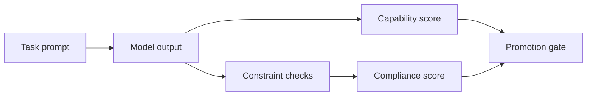

# Constraint-Compliance Engineering (IFEval/IFBench)

## Quick Recap
- Smart models can still fail strict instruction constraints.
- Compliance testing should reflect real parser and contract requirements.
- Severity tiers improve remediation prioritization.

## Concept Clarity
In production agent systems, instruction-following quality often gates reliability more than general reasoning. IFEval/IFBench should include:
- format constraints
- prohibition constraints
- multi-step instruction bundles

## Mermaid Visual

## Applied Case
A model with strong reasoning scores repeatedly broke JSON schema contracts. Adding strict IFEval-style parser checks prevented release until structured-output compliance recovered.

## Practical Application Checklist
1. Mirror production schemas in eval prompts.
2. Track violation types by severity.
3. Include parser-pass rate as a primary metric.
4. Block promotion on critical compliance failures.

## Primary References
- https://arxiv.org/abs/2311.07911
- https://arxiv.org/abs/2402.07814
