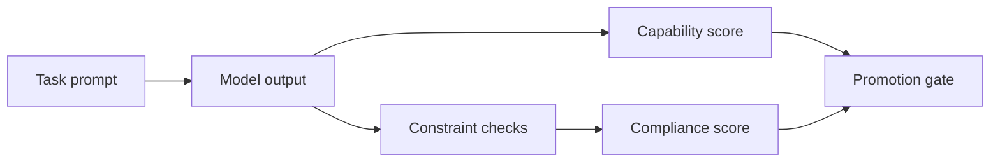

## 😄 Meme Opener

> *"Output format: JSON. Actual output: JSON with a paragraph of explanation before and after."*

# Constraint-Compliance Engineering (IFEval/IFBench)

## Quick Recap
- Smart models can still fail strict instruction constraints.
- Compliance testing should reflect real parser and contract requirements.
- Severity tiers improve remediation prioritization.

## Concept Clarity
In production agent systems, instruction-following quality often gates reliability more than general reasoning. IFEval/IFBench should include:
- format constraints
- prohibition constraints
- multi-step instruction bundles

## Mermaid Visual

## Applied Case
A model with strong reasoning scores repeatedly broke JSON schema contracts. Adding strict IFEval-style parser checks prevented release until structured-output compliance recovered.

## Practical Application Checklist
1. Mirror production schemas in eval prompts.
2. Track violation types by severity.
3. Include parser-pass rate as a primary metric.
4. Block promotion on critical compliance failures.

## Primary References
- https://arxiv.org/abs/2311.07911
- https://arxiv.org/abs/2402.07814

---

## 🎓 Harvard-Style Case Study — Instruction following as a first-class eval dimension

**Context:** A team built an agent that required strictly formatted JSON output. The model scored 91% on general benchmarks. In production, it added prose before and after JSON in 30% of responses — breaking the downstream parser.

**The tension:** Ship fast vs build evaluation infrastructure that catches real failures before users do.

**Decision options:**
1. Add IFEval as a release gate for instruction-following
2. add output schema validation as a hard gate
3. add a post-processing step to strip non-JSON content

**Discussion questions:**
1. What observable signal would have caught this issue before it reached production users?
2. Which option gives the best coverage/effort tradeoff for a 2-engineer team?
3. Write a one-sentence eval gate rule that would prevent this specific failure mode.

---

## 🤖 Solo AI Discussion Prompt

**Red Team:** "You are reviewing this eval strategy. Assume it will miss a real failure in production. Describe the top 2 failure modes it won't catch and how you'd close those gaps."

**Socratic Coach:** "Ask me one question at a time about this benchmark decision. Force me to justify each choice with evidence. After 6 questions, tell me what I'm missing."
