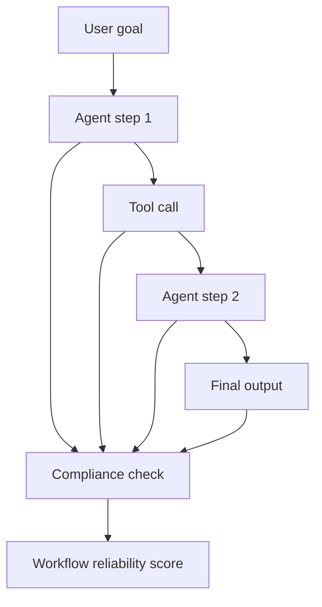

# Agent Workflow Reliability with Instruction Benchmarks

## Quick Recap
- Agent systems are brittle when instruction adherence is weak.
- Workflow-level compliance metrics should be first-class.
- Benchmark results must map to operational incident risk.

## Concept Clarity
A robust agent eval stack includes:
- step-level instruction adherence
- tool-call argument format compliance
- end-to-end success under constraint bundles

## Mermaid Visual

## Applied Case
A customer-support agent passed single-turn evals but failed multi-step workflows due to tool-argument formatting drift. Step-level compliance checks reduced incident rate after rollout.

## Practical Application Checklist
1. Define critical workflow checkpoints and required constraints.
2. Measure step-level and end-to-end adherence.
3. Store failed traces for replay and remediation.
4. Gate deployment on workflow reliability minimums.

## Primary References
- https://arxiv.org/abs/2311.07911
- https://arxiv.org/abs/2402.07814
