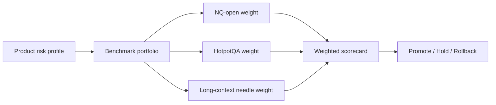

## 😄 Meme Opener

> *"We have 47 benchmarks. None of them test what our users actually do."*

# Benchmark Portfolio Design and Scorecards: Core Concepts

## Quick Recap
- Use a benchmark portfolio, not a single benchmark family.
- Weight benchmarks by business-critical risk and failure cost.
- Define promotion thresholds with uncertainty intervals and rollback triggers.

## Concept Clarity
Portfolio design translates business strategy into technical gates. For retrieval-heavy assistants, **NQ-open** and **HotpotQA** should carry meaningful weight. For long-doc copilots, add **needle-style long-context recall** as a hard quality gate.

A practical pattern is:
- **Coverage metrics** (did we answer?)
- **Reasoning metrics** (did we combine evidence correctly?)
- **Context utilization metrics** (did we find buried facts across long prompts?)

## Mermaid Visual

## Applied Case
A legal copilot team initially over-weighted generic reasoning and under-weighted long-context recall. After adding a high-weight needle slice and HotpotQA slice, a previously “top” model failed promotion, preventing a production regression on long contract analysis.

## Practical Application Checklist
1. Map each benchmark family to one real production risk.
2. Set explicit minimums for NQ-open, HotpotQA, and long-context recall where relevant.
3. Keep a weighted composite score, but publish family-level subscores.
4. Gate promotion on red-line failures even when composite score is high.

## Primary References
- https://www.nist.gov/itl/ai-risk-management-framework
- https://aclanthology.org/Q19-1026/
- https://aclanthology.org/D18-1259/
- https://arxiv.org/abs/2307.03172

## Downloadable Practical Artifacts
- [Benchmark Portfolio Scorecard (CSV)](/assets/courses/llm-benchmarking-academy/downloads/benchmark-portfolio-scorecard.csv)
- [Benchmark Decision Matrix (Markdown)](/assets/courses/llm-benchmarking-academy/downloads/benchmark-decision-matrix.md)
- [Eval Run Manifest Template (JSON)](/assets/courses/llm-benchmarking-academy/downloads/eval-run-manifest-template.json)
- [Retrieval + Long-Context Eval Template (JSON)](/assets/courses/llm-benchmarking-academy/downloads/retrieval-long-context-eval-template.json)
- [Benchmark Governance Checklist](/assets/courses/llm-benchmarking-academy/downloads/benchmark-governance-checklist.md)

## Anti-Pattern to Avoid
Averaging unrelated benchmarks into one number without showing family-level failures.

---

## 🎓 Harvard-Style Case Study — Benchmark suite design and CI integration

**Context:** A team assembled a 12-benchmark scorecard. It took 4 hours to run. It was never run before shipping because 'it takes too long.' The model degraded in production for 3 weeks before anyone noticed.

**The tension:** Ship fast vs build evaluation infrastructure that catches real failures before users do.

**Decision options:**
1. Reduce the scorecard to 3 critical benchmarks and run them as CI gates
2. add a fast 15-minute subset run as a pre-merge gate
3. keep the full suite but run it only on release branches

**Discussion questions:**
1. What observable signal would have caught this issue before it reached production users?
2. Which option gives the best coverage/effort tradeoff for a 2-engineer team?
3. Write a one-sentence eval gate rule that would prevent this specific failure mode.

---

## 🤖 Solo AI Discussion Prompt

**Red Team:** "You are reviewing this eval strategy. Assume it will miss a real failure in production. Describe the top 2 failure modes it won't catch and how you'd close those gaps."

**Socratic Coach:** "Ask me one question at a time about this benchmark decision. Force me to justify each choice with evidence. After 6 questions, tell me what I'm missing."
