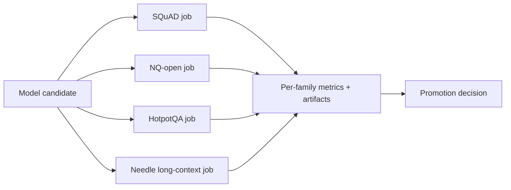

## 😄 Meme Opener

> *"The eval harness is more complex than the system it evaluates. This is fine."*

# Building an Evaluation Harness: Core Concepts

## Quick Recap
- Reproducibility requires strict versioning of data, prompts, model snapshots, and judge logic.
- Harnesses should produce auditable artifacts, not only dashboard metrics.
- Regression alerts should distinguish noise from meaningful degradation.

## Concept Clarity
A production eval harness is infrastructure, not a one-off notebook. It should run benchmark suites on schedule, preserve full provenance, and make it trivial to compare candidates under identical conditions.

For this course, implement dedicated jobs for:
- **SQuAD** (closed-context extractive QA baseline)
- **NQ-open** (retrieval + short factual answer quality)
- **HotpotQA** (multi-hop evidence synthesis)
- **Long-context needle** (position-robust recall at target context windows)

## Mermaid Visual

## Applied Case
A team could not explain a sudden score jump because prompt templates had silently changed. After adding immutable run manifests and hash-tracked configs across SQuAD, NQ-open, HotpotQA, and needle suites, they traced variance to decoding settings in minutes.

## Practical Application Checklist
1. Version datasets and prompt templates per benchmark family.
2. Log retrieval depth and context window used in each run.
3. Store per-family confusion/error slices, not only aggregate score.
4. Keep failure examples for manual review in each suite.

## Primary References
- https://github.com/EleutherAI/lm-evaluation-harness
- https://arize.com/llm-evaluation/
- https://arxiv.org/abs/1606.05250
- https://aclanthology.org/Q19-1026/
- https://aclanthology.org/D18-1259/

## Downloadable Practical Artifacts
- [Benchmark Portfolio Scorecard (CSV)](/assets/courses/llm-benchmarking-academy/downloads/benchmark-portfolio-scorecard.csv)
- [Benchmark Decision Matrix (Markdown)](/assets/courses/llm-benchmarking-academy/downloads/benchmark-decision-matrix.md)
- [Eval Run Manifest Template (JSON)](/assets/courses/llm-benchmarking-academy/downloads/eval-run-manifest-template.json)
- [Retrieval + Long-Context Eval Template (JSON)](/assets/courses/llm-benchmarking-academy/downloads/retrieval-long-context-eval-template.json)
- [Benchmark Governance Checklist](/assets/courses/llm-benchmarking-academy/downloads/benchmark-governance-checklist.md)

## Anti-Pattern to Avoid
Running ad hoc benchmarks without persisted metadata, seeds, and per-family diagnostics.

---

## 🎓 Harvard-Style Case Study — Build vs buy for eval infrastructure

**Context:** A team built a custom eval harness from scratch. It took 3 months. By the time it was ready, the model had been updated twice and the golden set was stale. They ran evals once and never updated them.

**The tension:** Ship fast vs build evaluation infrastructure that catches real failures before users do.

**Decision options:**
1. Use an existing eval framework (Langfuse, RAGAS, Evals)
2. build a thin adapter over an existing framework
3. build fully custom but define a maintenance owner from day one

**Discussion questions:**
1. What observable signal would have caught this issue before it reached production users?
2. Which option gives the best coverage/effort tradeoff for a 2-engineer team?
3. Write a one-sentence eval gate rule that would prevent this specific failure mode.

---

## 🤖 Solo AI Discussion Prompt

**Red Team:** "You are reviewing this eval strategy. Assume it will miss a real failure in production. Describe the top 2 failure modes it won't catch and how you'd close those gaps."

**Socratic Coach:** "Ask me one question at a time about this benchmark decision. Force me to justify each choice with evidence. After 6 questions, tell me what I'm missing."
