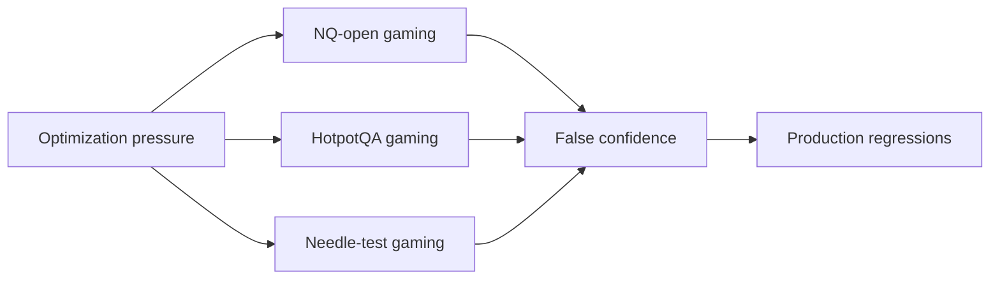

# Failure Modes and Benchmark Gaming: Core Concepts

## Quick Recap
- Data leakage can inflate benchmark scores while real capability stays flat.
- Prompt overfitting can create brittle gains that vanish in production.
- Guardrails need contamination checks and holdout governance.

## Concept Clarity
Benchmark gaming happens whenever optimization pressure outruns measurement governance. In this module, focus on family-specific risks:
- **NQ-open**: memorization contamination and retrieval shortcuts
- **HotpotQA**: shallow lexical matching that fakes multi-hop reasoning
- **Long-context needle**: synthetic format overfitting that fails on realistic long-document structure

## Mermaid Visual

## Applied Case
A release candidate improved benchmark scores after prompt tuning, but failed user tasks requiring long-document grounding. Root cause showed overfitting to synthetic needle structure and weak robustness to real sectioned documents.

## Practical Application Checklist
1. Keep contamination checks for benchmark and near-duplicate training data.
2. Require evidence-chain inspection for HotpotQA-style misses.
3. Include realistic long-doc variants alongside synthetic needle tests.
4. Report best-of-N policy and failed-run distribution transparently.

## Primary References
- https://arxiv.org/abs/2405.00332
- https://arxiv.org/abs/2310.17567
- https://arxiv.org/abs/2307.03172

## Downloadable Practical Artifacts
- [Benchmark Portfolio Scorecard (CSV)](/assets/courses/llm-benchmarking-academy/downloads/benchmark-portfolio-scorecard.csv)
- [Benchmark Decision Matrix (Markdown)](/assets/courses/llm-benchmarking-academy/downloads/benchmark-decision-matrix.md)
- [Eval Run Manifest Template (JSON)](/assets/courses/llm-benchmarking-academy/downloads/eval-run-manifest-template.json)
- [Retrieval + Long-Context Eval Template (JSON)](/assets/courses/llm-benchmarking-academy/downloads/retrieval-long-context-eval-template.json)
- [Benchmark Governance Checklist](/assets/courses/llm-benchmarking-academy/downloads/benchmark-governance-checklist.md)

## Anti-Pattern to Avoid
Publishing only top-line gains while hiding family-level regressions.
