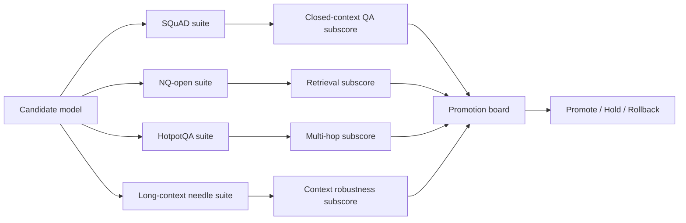

# Dedicated Module: Retrieval and Long-Context Evals: Core Concepts

## Quick Recap
- **SQuAD** tests closed-context extractive QA where evidence is already provided.
- **NQ-open** tests open-domain factual retrieval and short-answer correctness.
- **HotpotQA** tests multi-hop reasoning across multiple evidence passages.
- **Long-context needle tests** stress context utilization and position robustness at large context windows.

## Concept Clarity
Most teams under-measure retrieval and context handling. They rely on generic reasoning benchmarks, then get surprised in production by citation errors, missed facts in long docs, or shallow synthesis failures.

This dedicated module separates the capability families and enforces explicit gates:
- Closed-context QA gate (SQuAD slice)
- Retrieval quality gate (NQ-open slice)
- Multi-hop synthesis gate (HotpotQA slice)
- Long-context recall gate (needle-style slice with early/mid/late position checks)

## Mermaid Visual

## Applied Case
A support copilot looked strong on aggregate benchmark score but failed real escalations requiring document-grounded responses. Dedicated retrieval and long-context slices exposed poor recall in late-context sections and weak evidence chaining, preventing a high-risk promotion.

## Practical Application Checklist
1. Run all four suites under a fixed protocol and store full run manifests.
2. Report family-level subscores before any blended composite.
3. Set red-line thresholds for retrieval, multi-hop, and long-context robustness.
4. Include error buckets: retrieval miss, synthesis miss, position miss, hallucinated link.
5. Keep representative failure examples for manual QA.

## Primary References
- https://arxiv.org/abs/1606.05250
- https://aclanthology.org/Q19-1026/
- https://aclanthology.org/D18-1259/
- https://arxiv.org/abs/2307.03172

## Downloadable Practical Artifacts
- [Retrieval + Long-Context Eval Template (JSON)](/assets/courses/llm-benchmarking-academy/downloads/retrieval-long-context-eval-template.json)
- [Eval Run Manifest Template (JSON)](/assets/courses/llm-benchmarking-academy/downloads/eval-run-manifest-template.json)
- [Benchmark Portfolio Scorecard (CSV)](/assets/courses/llm-benchmarking-academy/downloads/benchmark-portfolio-scorecard.csv)

## Anti-Pattern to Avoid
Approving model promotion on a high composite score when any retrieval or long-context red-line gate fails.
