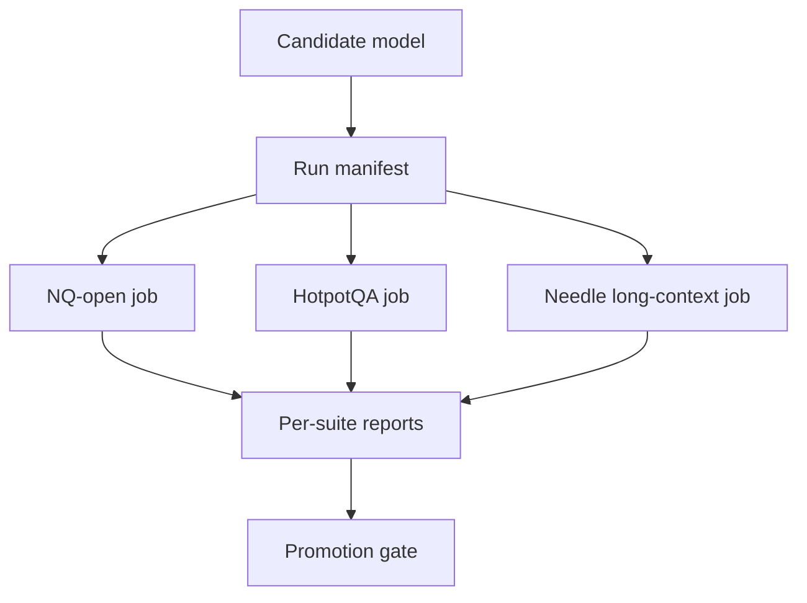

## 😄 Meme Opener

> *"Context window: 128k tokens. The answer was in token 127,999. The model started hallucinating at token 4,000."*

# Harness Implementation for Retrieval and Long-Context Evals

## Quick Recap
- Run NQ-open, HotpotQA, and long-context needle as distinct jobs.
- Keep one immutable manifest per run with protocol metadata.
- Log per-example failures for manual diagnosis.

## Concept Clarity
A robust harness has two layers:
1. **Execution layer**: runs each suite under fixed settings.
2. **Governance layer**: blocks promotion when protocol drift or red-line failures occur.

## Mermaid Visual

## Applied Case
A team compared two models and saw a 6-point jump. The manifest revealed different retrieval `top_k` settings between runs, invalidating the comparison. With drift checks in place, they reran and found only a 1-point gain.

## Practical Application Checklist
1. Version datasets and prompt templates by suite.
2. Log retrieval index version and context windows.
3. Store both aggregate metrics and failure examples.
4. Enforce protocol hash equality in candidate comparisons.

## Primary References
- https://github.com/EleutherAI/lm-evaluation-harness
- https://aclanthology.org/Q19-1026/
- https://aclanthology.org/D18-1259/

---

## 🎓 Harvard-Style Case Study — Long-context and retrieval evaluation

**Context:** A RAG system was evaluated on short-context retrieval. In production, long documents caused the model to lose context and hallucinate. The eval suite had no test cases longer than 2,000 tokens.

**The tension:** Ship fast vs build evaluation infrastructure that catches real failures before users do.

**Decision options:**
1. Add long-context test cases (8k, 32k, 128k) to the eval suite
2. add a needle-in-a-haystack test
3. add a retrieval quality gate that checks context relevance before generation

**Discussion questions:**
1. What observable signal would have caught this issue before it reached production users?
2. Which option gives the best coverage/effort tradeoff for a 2-engineer team?
3. Write a one-sentence eval gate rule that would prevent this specific failure mode.

---

## 🤖 Solo AI Discussion Prompt

**Red Team:** "You are reviewing this eval strategy. Assume it will miss a real failure in production. Describe the top 2 failure modes it won't catch and how you'd close those gaps."

**Socratic Coach:** "Ask me one question at a time about this benchmark decision. Force me to justify each choice with evidence. After 6 questions, tell me what I'm missing."
