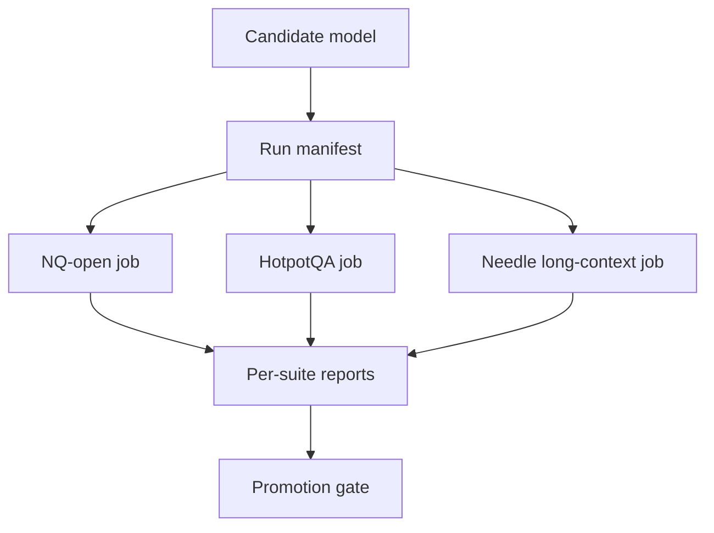

# Harness Implementation for Retrieval and Long-Context Evals

## Quick Recap
- Run NQ-open, HotpotQA, and long-context needle as distinct jobs.
- Keep one immutable manifest per run with protocol metadata.
- Log per-example failures for manual diagnosis.

## Concept Clarity
A robust harness has two layers:
1. **Execution layer**: runs each suite under fixed settings.
2. **Governance layer**: blocks promotion when protocol drift or red-line failures occur.

## Mermaid Visual

## Applied Case
A team compared two models and saw a 6-point jump. The manifest revealed different retrieval `top_k` settings between runs, invalidating the comparison. With drift checks in place, they reran and found only a 1-point gain.

## Practical Application Checklist
1. Version datasets and prompt templates by suite.
2. Log retrieval index version and context windows.
3. Store both aggregate metrics and failure examples.
4. Enforce protocol hash equality in candidate comparisons.

## Primary References
- https://github.com/EleutherAI/lm-evaluation-harness
- https://aclanthology.org/Q19-1026/
- https://aclanthology.org/D18-1259/
