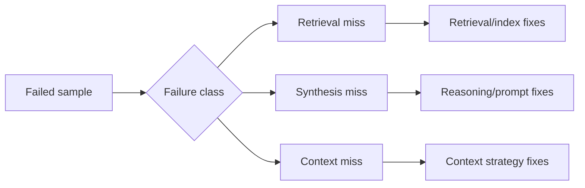

## 😄 Meme Opener

> *"Context window: 128k tokens. The answer was in token 127,999. The model started hallucinating at token 4,000."*

# Failure Analysis Playbook for Retrieval and Long-Context

## Quick Recap
- Not all misses are equal, classify first, optimize second.
- Needle pass rates should be sliced by early/mid/late position.
- A high average score can hide catastrophic long-context tails.

## Concept Clarity
Use a simple taxonomy:
- **Retrieval miss**: key evidence never surfaced.
- **Synthesis miss**: evidence retrieved but combined incorrectly.
- **Context miss**: evidence exists in context but model fails to recover it reliably.

## Mermaid Visual

## Applied Case
A long-doc assistant scored well overall but failed late-position needle slices. The issue was truncation and poor segment strategy, not general reasoning. Fixing chunking and retrieval windowing improved long-context robustness without changing the base model.

## Practical Application Checklist
1. Label at least 50 failed samples by failure class.
2. Break metrics by context length and needle position.
3. Track regression deltas for each failure class separately.
4. Require zero red-line breaches before promotion.

## Primary References
- https://arxiv.org/abs/2307.03172
- https://arxiv.org/abs/2405.00332
- https://arxiv.org/abs/2310.17567

---

## 🎓 Harvard-Style Case Study — Long-context and retrieval evaluation

**Context:** A RAG system was evaluated on short-context retrieval. In production, long documents caused the model to lose context and hallucinate. The eval suite had no test cases longer than 2,000 tokens.

**The tension:** Ship fast vs build evaluation infrastructure that catches real failures before users do.

**Decision options:**
1. Add long-context test cases (8k, 32k, 128k) to the eval suite
2. add a needle-in-a-haystack test
3. add a retrieval quality gate that checks context relevance before generation

**Discussion questions:**
1. What observable signal would have caught this issue before it reached production users?
2. Which option gives the best coverage/effort tradeoff for a 2-engineer team?
3. Write a one-sentence eval gate rule that would prevent this specific failure mode.

---

## 🤖 Solo AI Discussion Prompt

**Red Team:** "You are reviewing this eval strategy. Assume it will miss a real failure in production. Describe the top 2 failure modes it won't catch and how you'd close those gaps."

**Socratic Coach:** "Ask me one question at a time about this benchmark decision. Force me to justify each choice with evidence. After 6 questions, tell me what I'm missing."
