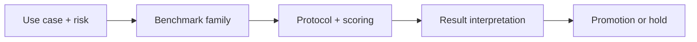

## 😄 Meme Opener

> *"The capstone: build an eval suite that doesn't lie to you."*

# Capstone: Production Benchmark Strategy: Core Concepts

## Quick Recap
- The capstone synthesizes benchmark choice, protocol design, and governance.
- A strategy is credible only if it includes rollout and rollback triggers.
- Executive communication matters: scores must map to business risk language.

## Concept Clarity
This module converts theory into an implementation plan. Learners produce a benchmark charter, scorecard, eval pipeline, and promotion policy aligned to one real product scenario.

## Mermaid Visual

## Applied Case
A platform team used this capstone framework to decide between two frontier models. Despite a lower headline score, the chosen model had superior instruction fidelity and lower high-severity failure risk, reducing launch incidents.

## Practical Application Checklist
1. Define the deployment decision this benchmark should influence.
2. State one blind spot this benchmark will not cover.
3. Pair with at least one complementary benchmark family.
4. Record thresholds and rollback conditions before comparing candidates.

## Primary References
- https://www.iso.org/standard/81230.html
- https://www.anthropic.com/news/constitutional-ai-harmlessness-from-ai-feedback

## Downloadable Practical Artifacts
- [Benchmark Portfolio Scorecard (CSV)](/assets/courses/llm-benchmarking-academy/downloads/benchmark-portfolio-scorecard.csv)
- [Benchmark Decision Matrix (Markdown)](/assets/courses/llm-benchmarking-academy/downloads/benchmark-decision-matrix.md)
- [Eval Run Manifest Template (JSON)](/assets/courses/llm-benchmarking-academy/downloads/eval-run-manifest-template.json)
- [Benchmark Governance Checklist](/assets/courses/llm-benchmarking-academy/downloads/benchmark-governance-checklist.md)

## Anti-Pattern to Avoid
Ending with benchmark analysis but no deployment policy or ownership model.

---

## 🎓 Harvard-Style Case Study — Eval suite maintenance and continuous improvement

**Context:** A team shipped a product with a comprehensive eval suite. 6 months later, the suite had never been updated. New model versions, new user behaviours, and new failure modes were accumulating invisibly.

**The tension:** Ship fast vs build evaluation infrastructure that catches real failures before users do.

**Decision options:**
1. Add a monthly eval suite review cadence
2. add a staleness detector that flags golden sets older than 90 days
3. add a user-feedback-driven eval expansion pipeline

**Discussion questions:**
1. What observable signal would have caught this issue before it reached production users?
2. Which option gives the best coverage/effort tradeoff for a 2-engineer team?
3. Write a one-sentence eval gate rule that would prevent this specific failure mode.

---

## 🤖 Solo AI Discussion Prompt

**Red Team:** "You are reviewing this eval strategy. Assume it will miss a real failure in production. Describe the top 2 failure modes it won't catch and how you'd close those gaps."

**Socratic Coach:** "Ask me one question at a time about this benchmark decision. Force me to justify each choice with evidence. After 6 questions, tell me what I'm missing."
