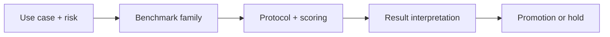

# Capstone: Production Benchmark Strategy: Core Concepts

## Quick Recap
- The capstone synthesizes benchmark choice, protocol design, and governance.
- A strategy is credible only if it includes rollout and rollback triggers.
- Executive communication matters: scores must map to business risk language.

## Concept Clarity
This module converts theory into an implementation plan. Learners produce a benchmark charter, scorecard, eval pipeline, and promotion policy aligned to one real product scenario.

## Mermaid Visual

## Applied Case
A platform team used this capstone framework to decide between two frontier models. Despite a lower headline score, the chosen model had superior instruction fidelity and lower high-severity failure risk, reducing launch incidents.

## Practical Application Checklist
1. Define the deployment decision this benchmark should influence.
2. State one blind spot this benchmark will not cover.
3. Pair with at least one complementary benchmark family.
4. Record thresholds and rollback conditions before comparing candidates.

## Primary References
- https://www.iso.org/standard/81230.html
- https://www.anthropic.com/news/constitutional-ai-harmlessness-from-ai-feedback

## Downloadable Practical Artifacts
- [Benchmark Portfolio Scorecard (CSV)](/assets/courses/llm-benchmarking-academy/downloads/benchmark-portfolio-scorecard.csv)
- [Benchmark Decision Matrix (Markdown)](/assets/courses/llm-benchmarking-academy/downloads/benchmark-decision-matrix.md)
- [Eval Run Manifest Template (JSON)](/assets/courses/llm-benchmarking-academy/downloads/eval-run-manifest-template.json)
- [Benchmark Governance Checklist](/assets/courses/llm-benchmarking-academy/downloads/benchmark-governance-checklist.md)

## Anti-Pattern to Avoid
Ending with benchmark analysis but no deployment policy or ownership model.
