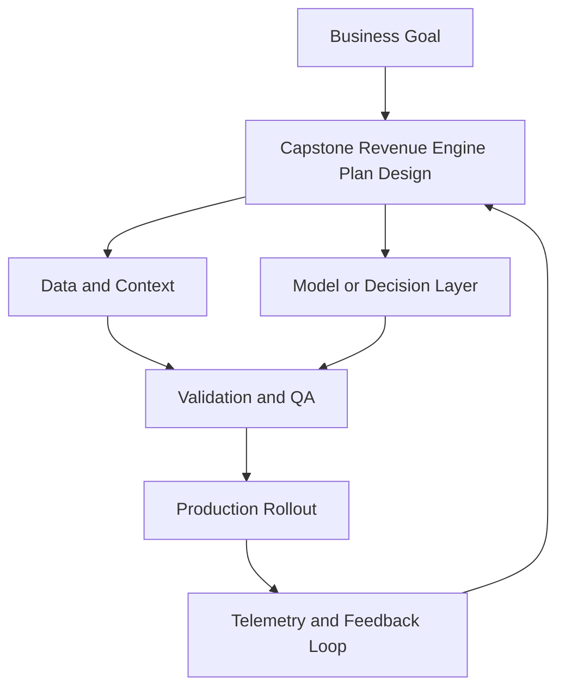

---

## 🏗️ Your Running Project

**What you're building:** You are building a full-funnel campaign for a SaaS product launch — from audience targeting to conversion measurement.
**What this module adds:** Build the capstone component.

> *Every decision here carries forward.*

# Capstone Revenue Engine Plan

## Summary

Create a full-funnel operating plan

## Outcomes

- Create a full-funnel operating plan
- Define KPI tree with owners and cadences
- Produce a 90-day implementation roadmap
- Choose the first organisational principle for week one

## Theory

- Operating cadences
- Revenue systems design
- Cross-functional execution rhythms
- Clean-room insight layers
- Cross-channel attribution discipline
- KPI trees that connect finance and growth

## Practical

- Assemble a final stack blueprint
- Create a KPI tree and reporting cadence
- Build a 90-day plan with milestones
- Assign weekly owners for each metric
- Write one executive decision rule for mixed signals

## Tools

Notion, Looker Studio, BigQuery, Slack/Asana

## Case Study

- **Protagonist:** New CMO
- **Context:** One quarter to show both growth and efficiency gains.
- **Dilemma:** Prioritize rapid wins or foundational fixes?
- **Options:**
  - Rapid campaign wins only
  - Foundation rebuild only
  - Dual-track: quick wins + architecture hardening
- **Recommendation:** Dual-track execution with hard milestone gates and explicit risk control.
- **Discussion questions:**
  - You have 90 days as new CMO. What are your first three week-one decisions?
  - What KPI tree aligns finance and growth, and which node is reviewed weekly at exec level?
  - Would you start with a clean-room insight layer, attribution discipline, or KPI tree?
  - How do you prove non-Amazon media contributes to Amazon outcomes rather than merely correlates with them?

<!-- VNEXT_AUGMENTATION -->
## vNext Lesson Augmentation

### Meme opener

### Quick Recap
- Start with a business outcome and measurable success criteria.
- Design the operating workflow before selecting tools.
- Add validation, observability, and rollback controls from day one.
- Use lightweight artifacts so decisions are auditable and repeatable.

### Concept Clarity
Think of this module like building a smart kitchen. The recipe (process), ingredients (data), and tasting checks (evaluation) matter more than buying the fanciest oven. If one part fails, you need a backup plan so dinner still gets served.

### System map (mermaid)

### Harvard-style case
**Case:** Capstone Revenue Engine Plan in a mid-market business unit.  
**Background:** Team needs faster execution without losing governance.  
**Complication:** Metrics are improving in pilots but unstable in production.  
**Analysis:** Missing control points (ownership, QA gates, and incident rules) increase variance.  
**Recommendation:** Introduce a phased operating model with explicit guardrails, then scale only when KPI and risk thresholds hold for two consecutive cycles.

### Primary references
- [NIST AI RMF](https://www.nist.gov/itl/ai-risk-management-framework)
- [Google SRE Workbook (SLOs)](https://sre.google/workbook/)
- [Harvard Business Review (Analytics & AI)](https://hbr.org/topic/analytics-and-ai)

### Downloadable artifacts
- [Module worksheet](/assets/courses/martech-adtech-academy/downloads/capstone-worksheet.md)
- [Execution checklist (CSV)](/assets/courses/martech-adtech-academy/downloads/capstone-checklist.csv)

### Media links
- [Module media list](/assets/courses/martech-adtech-academy/videos/capstone-media.md)
- [MIT Sloan AI channel](https://www.youtube.com/@mitsloan)
- [Stanford HAI talks](https://www.youtube.com/@stanfordhai)

## 😄 Meme Opener

## Video Boosters
- **Quick Recap video:** [Watch](/assets/courses/martech-adtech-academy/videos/capstone-quick-recap.mp4)
- **Concept Clarity video:** [Watch](/assets/courses/martech-adtech-academy/videos/capstone-concept-clarity.mp4)

---

## 🎓 Harvard-Style Case Study — Cross-channel campaign integration and attribution

**Context:** A marketing team completed all modules but never tied the tactics together into a unified campaign. Each channel operated independently. Attribution was impossible.

**The tension:** Ship the campaign vs build the process control that prevents the failure.

**Decision options:**
1. Build a unified campaign brief that connects every channel to one goal
2. assign a campaign manager who owns cross-channel consistency
3. add a weekly cross-channel review before any campaign launches

**Discussion questions:**
1. What signal would have caught this before it damaged the business?
2. Which option gives the best risk/effort tradeoff for a lean team?
3. Write a one-sentence policy that would prevent this failure mode.

---

## 🤖 Solo AI Discussion Prompt

**Red Team:** "You are reviewing this marketing decision. Find the top 2 ways it will fail and how to close those gaps."
