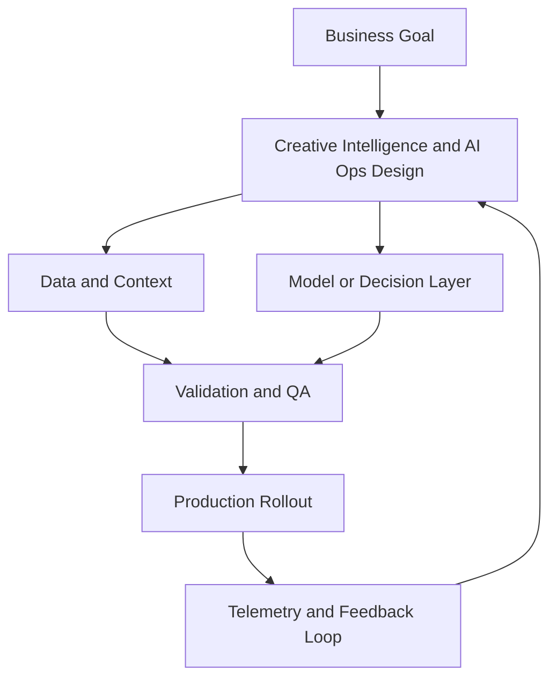

# Creative Intelligence and AI Ops

## Summary

Run structured creative testing

## Outcomes

- Run structured creative testing
- Use AI for asset generation with controls
- Operationalize winner promotion
- Judge creative on downstream outcomes, not just CTR

## Theory

- Creative strategy frameworks
- Testing matrix design
- AI content operations and governance
- Variant promotion across placements
- Headline CTR versus downstream conversion
- Generalizable component systems

## Practical

- Create a creative hypothesis backlog
- Define test cell and holdout logic
- Implement winner-promotion policy
- Set a rule for cross-placement reuse
- Tag assets by component and context

## Tools

Meta Ads Creative Hub, Google Ads Asset Groups, Canva, Runway, Midjourney

## Case Study

- **Protagonist:** Creative lead
- **Context:** Creative output increased 5x but CPAs worsened.
- **Dilemma:** Scale volume further or tighten quality controls?
- **Options:**
  - Maximize creative volume
  - Reduce variants and increase strategic rigor
  - Keep volume but enforce strict test governance
- **Recommendation:** Keep volume, introduce strict hypothesis and promotion criteria.
- **Discussion questions:**
  - Volume is up 5x and CPA is worse. What do you cut first: channels, variants, or hypotheses?
  - Define the promotion rule a creative must meet before it gets scaled.
  - Which winner matters most, headline CTR or downstream conversion?
  - What makes a component system better than a single ad winner?

<!-- VNEXT_AUGMENTATION -->
## vNext Lesson Augmentation

### Meme opener

### Quick Recap
- Start with a business outcome and measurable success criteria.
- Design the operating workflow before selecting tools.
- Add validation, observability, and rollback controls from day one.
- Use lightweight artifacts so decisions are auditable and repeatable.

### Concept Clarity
Think of this module like building a smart kitchen. The recipe (process), ingredients (data), and tasting checks (evaluation) matter more than buying the fanciest oven. If one part fails, you need a backup plan so dinner still gets served.

### System map (mermaid)

### Harvard-style case
**Case:** Creative Intelligence and AI Ops in a mid-market business unit.  
**Background:** Team needs faster execution without losing governance.  
**Complication:** Metrics are improving in pilots but unstable in production.  
**Analysis:** Missing control points (ownership, QA gates, and incident rules) increase variance.  
**Recommendation:** Introduce a phased operating model with explicit guardrails, then scale only when KPI and risk thresholds hold for two consecutive cycles.

### Primary references
- [NIST AI RMF](https://www.nist.gov/itl/ai-risk-management-framework)
- [Google SRE Workbook (SLOs)](https://sre.google/workbook/)
- [Harvard Business Review (Analytics & AI)](https://hbr.org/topic/analytics-and-ai)

### Downloadable artifacts
- [Module worksheet](/assets/courses/martech-adtech-academy/downloads/creative-ai-worksheet.md)
- [Execution checklist (CSV)](/assets/courses/martech-adtech-academy/downloads/creative-ai-checklist.csv)

### Media links
- [Module media list](/assets/courses/martech-adtech-academy/videos/creative-ai-media.md)
- [MIT Sloan AI channel](https://www.youtube.com/@mitsloan)
- [Stanford HAI talks](https://www.youtube.com/@stanfordhai)

## 😄 Meme Opener

## Video Boosters
- **Quick Recap video:** [Watch](/assets/courses/martech-adtech-academy/videos/creative-ai-quick-recap.mp4)
- **Concept Clarity video:** [Watch](/assets/courses/martech-adtech-academy/videos/creative-ai-concept-clarity.mp4)
