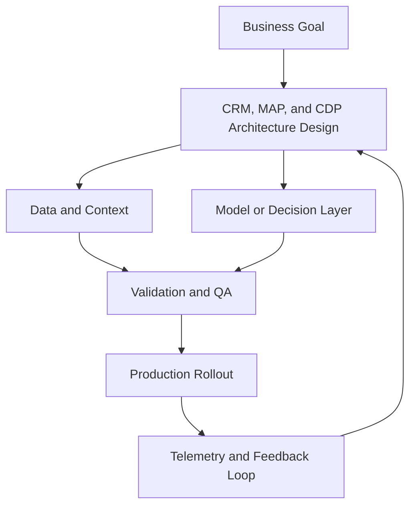

# CRM, MAP, and CDP Architecture

## Summary

Separate CRM, MAP, and CDP concerns

## Outcomes

- Separate CRM, MAP, and CDP concerns
- Design activation and orchestration flows
- Evaluate composable versus packaged CDP models
- State the lock-in risk you will accept explicitly

## Theory

- System responsibilities and integration boundaries
- Warehouse-native activation patterns
- Latency, freshness, and personalization tradeoffs
- Composable CDP ownership and data control
- Packaged platform convenience versus flexibility
- Failure modes in integration-heavy programmes

## Practical

- Build a reference architecture diagram
- Define activation SLA targets by audience type
- Choose the canonical profile source
- Mark which workflows must stay real-time
- Set one rule for when not to replicate data

## Tools

Salesforce, HubSpot, Braze, mParticle, Tealium, Snowplow

## Case Study

- **Protagonist:** CTO + CMO steering committee
- **Context:** Board asks for one platform to reduce cost and complexity.
- **Dilemma:** Single suite purchase vs composable data-first stack.
- **Options:**
  - Standardize on one suite vendor
  - Keep warehouse as source of truth and use a light orchestration layer
  - Hybrid: suite for CRM workflows + composable activation
- **Recommendation:** Hybrid architecture with explicit contracts gives speed now and flexibility later.
- **Discussion questions:**
  - Choose one architecture today: suite, composable, or hybrid. Defend your choice in one sentence.
  - Which lock-in risk are you willing to accept this year, and which is unacceptable?
  - What would you refuse to outsource to the vendor?
  - Which integration would you simplify first?

<!-- VNEXT_AUGMENTATION -->
## vNext Lesson Augmentation

### Meme opener

### Quick Recap
- Start with a business outcome and measurable success criteria.
- Design the operating workflow before selecting tools.
- Add validation, observability, and rollback controls from day one.
- Use lightweight artifacts so decisions are auditable and repeatable.

### Concept Clarity
Think of this module like building a smart kitchen. The recipe (process), ingredients (data), and tasting checks (evaluation) matter more than buying the fanciest oven. If one part fails, you need a backup plan so dinner still gets served.

### System map (mermaid)

### Harvard-style case
**Case:** CRM, MAP, and CDP Architecture in a mid-market business unit.  
**Background:** Team needs faster execution without losing governance.  
**Complication:** Metrics are improving in pilots but unstable in production.  
**Analysis:** Missing control points (ownership, QA gates, and incident rules) increase variance.  
**Recommendation:** Introduce a phased operating model with explicit guardrails, then scale only when KPI and risk thresholds hold for two consecutive cycles.

### Primary references
- [NIST AI RMF](https://www.nist.gov/itl/ai-risk-management-framework)
- [Google SRE Workbook (SLOs)](https://sre.google/workbook/)
- [Harvard Business Review (Analytics & AI)](https://hbr.org/topic/analytics-and-ai)

### Downloadable artifacts
- [Module worksheet](/assets/courses/martech-adtech-academy/downloads/crm-map-cdp-worksheet.md)
- [Execution checklist (CSV)](/assets/courses/martech-adtech-academy/downloads/crm-map-cdp-checklist.csv)

### Media links
- [Module media list](/assets/courses/martech-adtech-academy/videos/crm-map-cdp-media.md)
- [MIT Sloan AI channel](https://www.youtube.com/@mitsloan)
- [Stanford HAI talks](https://www.youtube.com/@stanfordhai)

## 😄 Meme Opener

## Video Boosters
- **Quick Recap video:** [Watch](/assets/courses/martech-adtech-academy/videos/crm-map-cdp-quick-recap.mp4)
- **Concept Clarity video:** [Watch](/assets/courses/martech-adtech-academy/videos/crm-map-cdp-concept-clarity.mp4)
