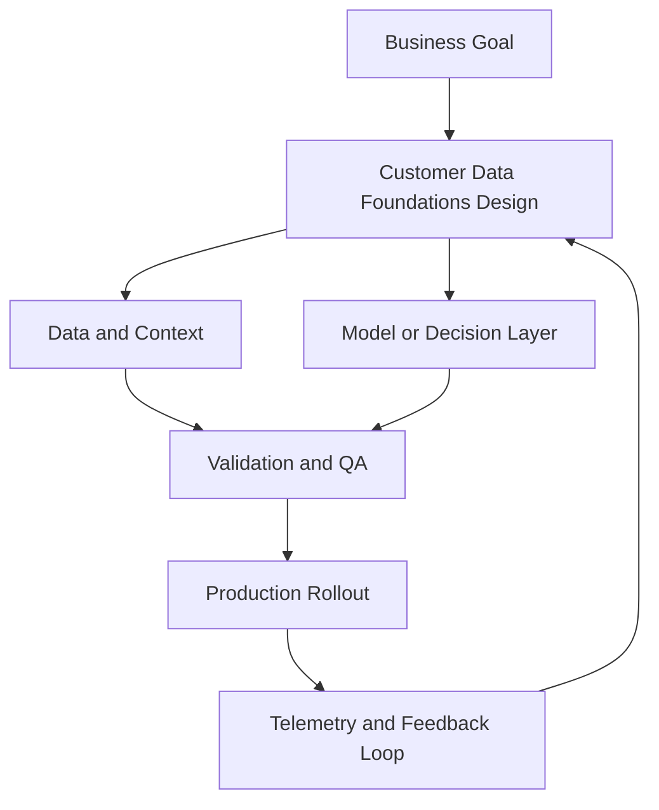

---

## 🏗️ Your Running Project

**What you're building:** You are building a full-funnel campaign for a SaaS product launch — from audience targeting to conversion measurement.
**What this module adds:** Build the customer data component.

> *Every decision here carries forward.*

# Customer Data Foundations

## Summary

Design a reliable event taxonomy

## Outcomes

- Design a reliable event taxonomy
- Define identity resolution across touchpoints
- Implement quality and governance guardrails
- Choose the canonical source when schemas conflict

## Theory

- First-party data architecture and transparency
- Identity graph basics and stitching logic
- Data contracts, QA, and observability
- System-of-record decisions under launch pressure
- Server-side activation patterns for trusted events
- Governance for schema change and versioning

## Practical

- Draft an event schema for lead-to-revenue lifecycle
- Map anonymous-to-known transitions across touchpoints
- Create a data quality checklist with failure thresholds
- Define a schema owner and change approval path
- Write one reconciliation rule for analytics and CRM

## Tools

Segment, RudderStack, dbt, BigQuery, Snowflake

## Case Study

- **Protagonist:** Head of Marketing Ops
- **Context:** Web and app teams send conflicting conversion events.
- **Dilemma:** Ship faster with partial fixes or halt launch to refactor tracking?
- **Options:**
  - Patch in GTM only
  - Enforce cross-team event naming contract
  - Move all tracking to server-side immediately
- **Recommendation:** Enforce a naming contract and QA gates first, then phase server-side migration for critical events.
- **Discussion questions:**
  - You launch in 7 days with conflicting event definitions. What do you ship now and what do you block?
  - Which event source becomes system-of-record first, and why?
  - Who has final authority over schema changes?
  - What explicit failure would stop launch?

<!-- VNEXT_AUGMENTATION -->
## vNext Lesson Augmentation

### Meme opener

### Quick Recap
- Start with a business outcome and measurable success criteria.
- Design the operating workflow before selecting tools.
- Add validation, observability, and rollback controls from day one.
- Use lightweight artifacts so decisions are auditable and repeatable.

### Concept Clarity
Think of this module like building a smart kitchen. The recipe (process), ingredients (data), and tasting checks (evaluation) matter more than buying the fanciest oven. If one part fails, you need a backup plan so dinner still gets served.

### System map (mermaid)

### Harvard-style case
**Case:** Customer Data Foundations in a mid-market business unit.  
**Background:** Team needs faster execution without losing governance.  
**Complication:** Metrics are improving in pilots but unstable in production.  
**Analysis:** Missing control points (ownership, QA gates, and incident rules) increase variance.  
**Recommendation:** Introduce a phased operating model with explicit guardrails, then scale only when KPI and risk thresholds hold for two consecutive cycles.

### Primary references
- [NIST AI RMF](https://www.nist.gov/itl/ai-risk-management-framework)
- [Google SRE Workbook (SLOs)](https://sre.google/workbook/)
- [Harvard Business Review (Analytics & AI)](https://hbr.org/topic/analytics-and-ai)

### Downloadable artifacts
- [Module worksheet](/assets/courses/martech-adtech-academy/downloads/customer-data-worksheet.md)
- [Execution checklist (CSV)](/assets/courses/martech-adtech-academy/downloads/customer-data-checklist.csv)

### Media links
- [Module media list](/assets/courses/martech-adtech-academy/videos/customer-data-media.md)
- [MIT Sloan AI channel](https://www.youtube.com/@mitsloan)
- [Stanford HAI talks](https://www.youtube.com/@stanfordhai)

## 😄 Meme Opener

## Video Boosters
- **Quick Recap video:** [Watch](/assets/courses/martech-adtech-academy/videos/customer-data-quick-recap.mp4)
- **Concept Clarity video:** [Watch](/assets/courses/martech-adtech-academy/videos/customer-data-concept-clarity.mp4)

---

## 🎓 Harvard-Style Case Study — First-party data activation and third-party data dependency

**Context:** A team collected first-party data for two years but never activated it. They continued buying third-party audience segments while sitting on richer owned data.

**The tension:** Ship the campaign vs build the process control that prevents the failure.

**Decision options:**
1. Audit owned data assets before any third-party data purchase
2. build a first-party data activation plan with specific use cases
3. add a data activation review to the quarterly marketing review

**Discussion questions:**
1. What signal would have caught this before it damaged the business?
2. Which option gives the best risk/effort tradeoff for a lean team?
3. Write a one-sentence policy that would prevent this failure mode.

---

## 🤖 Solo AI Discussion Prompt

**Red Team:** "You are reviewing this marketing decision. Find the top 2 ways it will fail and how to close those gaps."
