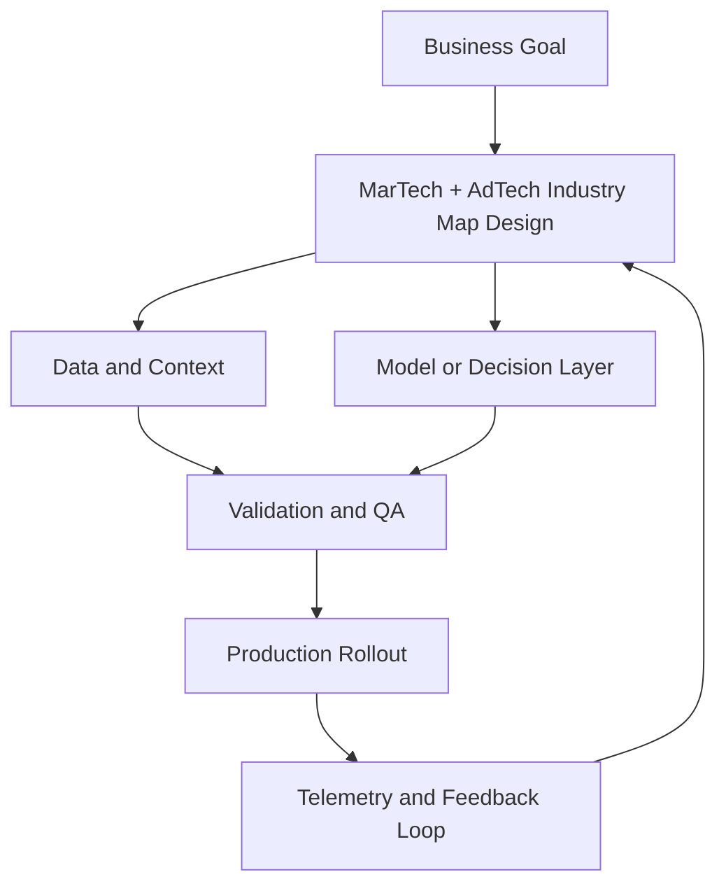

# MarTech + AdTech Industry Map

## Summary

Differentiate MarTech and AdTech responsibilities in an operating model

## Outcomes

- Differentiate MarTech and AdTech responsibilities in an operating model
- Map stack layers from capture to activation with clear owners
- Explain why vendor churn changes governance priorities
- Set the first 90-day control mechanism for stack decisions

## Theory

- Ecosystem structure, categories, and value flow
- Platform vs composable architecture tradeoffs
- Stack churn, vendor lifecycles, and renewal risk
- Ownership boundaries across marketing, ops, and data
- Control layers for data contracts, QA, and reporting
- Decision cadence for stack rationalization

## Practical

- Create a current-state stack inventory by domain
- Label each tool as core, edge, or legacy
- Assign owners and renewal dates for every system
- Identify the weakest data contract in the stack
- Define one consolidation rule and one exception rule

## Tools

Miro, Notion, Lucidchart

## Case Study

- **Protagonist:** New VP Growth at a Series B SaaS company
- **Context:** CAC is rising while the team uses 27 disconnected tools.
- **Dilemma:** Consolidate immediately or keep specialist tools for speed?
- **Options:**
  - Buy one all-in-one cloud and migrate in 90 days
  - Keep best-of-breed and standardize data contracts first
  - Pause spend and redesign measurement before architecture changes
- **Recommendation:** Standardize data contracts and reporting first, then phase consolidation by lowest switching-risk domains.
- **Discussion questions:**
  - Your stack touches 12 vendors today. Given annual churn and category growth, what control mechanism matters more in the next 90 days: vendor consolidation or standardised data contracts?
  - What metric would prove you chose correctly?
  - Which system becomes the first source of truth, and who owns it?
  - Where would you accept temporary duplication, and where would you not?

<!-- VNEXT_AUGMENTATION -->
## vNext Lesson Augmentation

### Meme opener

### Quick Recap
- Start with a business outcome and measurable success criteria.
- Design the operating workflow before selecting tools.
- Add validation, observability, and rollback controls from day one.
- Use lightweight artifacts so decisions are auditable and repeatable.

### Concept Clarity
Think of this module like building a smart kitchen. The recipe (process), ingredients (data), and tasting checks (evaluation) matter more than buying the fanciest oven. If one part fails, you need a backup plan so dinner still gets served.

### System map (mermaid)

### Harvard-style case
**Case:** MarTech + AdTech Industry Map in a mid-market business unit.  
**Background:** Team needs faster execution without losing governance.  
**Complication:** Metrics are improving in pilots but unstable in production.  
**Analysis:** Missing control points (ownership, QA gates, and incident rules) increase variance.  
**Recommendation:** Introduce a phased operating model with explicit guardrails, then scale only when KPI and risk thresholds hold for two consecutive cycles.

### Primary references
- [NIST AI RMF](https://www.nist.gov/itl/ai-risk-management-framework)
- [Google SRE Workbook (SLOs)](https://sre.google/workbook/)
- [Harvard Business Review (Analytics & AI)](https://hbr.org/topic/analytics-and-ai)

### Downloadable artifacts
- [Module worksheet](/assets/courses/martech-adtech-academy/downloads/industry-map-worksheet.md)
- [Execution checklist (CSV)](/assets/courses/martech-adtech-academy/downloads/industry-map-checklist.csv)

### Media links
- [Module media list](/assets/courses/martech-adtech-academy/videos/industry-map-media.md)
- [MIT Sloan AI channel](https://www.youtube.com/@mitsloan)
- [Stanford HAI talks](https://www.youtube.com/@stanfordhai)

## 😄 Meme Opener

## Video Boosters
- **Quick Recap video:** [Watch](/assets/courses/martech-adtech-academy/videos/industry-map-quick-recap.mp4)
- **Concept Clarity video:** [Watch](/assets/courses/martech-adtech-academy/videos/industry-map-concept-clarity.mp4)
