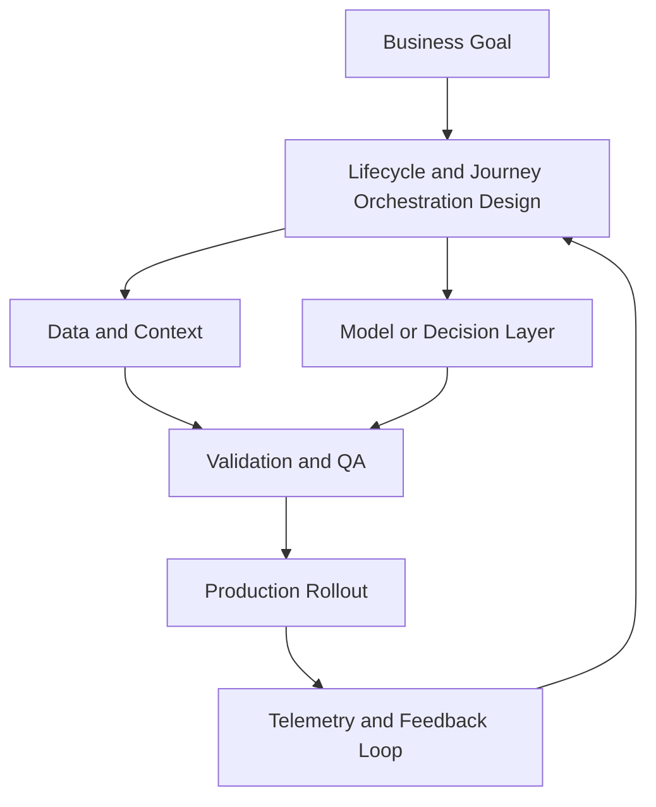

# Lifecycle and Journey Orchestration

## Summary

Design lifecycle funnels

## Outcomes

- Design lifecycle funnels
- Build trigger-based journeys
- Reduce churn and message fatigue
- Select the signals that matter and exclude the rest

## Theory

- Lifecycle stages and intent signals
- Journey triggers and suppression logic
- Messaging frequency governance
- Declared, behavioural, and contextual signals
- Signal selection for onboarding and retention
- Rules for exclusions and escalation

## Practical

- Draft 3 lifecycle journeys
- Add suppression and conflict rules
- Define success metrics per journey
- List the first 5 lifecycle signals to trust
- Specify one signal to deliberately exclude

## Tools

Braze, Iterable, Customer.io, HubSpot Workflows

## Case Study

- **Protagonist:** Lifecycle manager
- **Context:** Strong top-of-funnel growth but flat activation and retention.
- **Dilemma:** Add acquisition budget or fix post-signup journey first?
- **Options:**
  - Scale acquisition first
  - Pause growth spend and rework onboarding
  - Balanced: maintain spend while fixing activation bottlenecks
- **Recommendation:** Balanced approach with activation metrics as the primary guardrail.
- **Discussion questions:**
  - Trials are strong but activation is weak. Do you pause acquisition, maintain spend, or split the approach?
  - Which activation signal in the next 14 days determines whether your decision was right?
  - Would you trust declared identity data, behavioural events, or contextual usage signals first?
  - What would you deliberately exclude from the trigger set?

<!-- VNEXT_AUGMENTATION -->
## vNext Lesson Augmentation

### Meme opener

### Quick Recap
- Start with a business outcome and measurable success criteria.
- Design the operating workflow before selecting tools.
- Add validation, observability, and rollback controls from day one.
- Use lightweight artifacts so decisions are auditable and repeatable.

### Concept Clarity
Think of this module like building a smart kitchen. The recipe (process), ingredients (data), and tasting checks (evaluation) matter more than buying the fanciest oven. If one part fails, you need a backup plan so dinner still gets served.

### System map (mermaid)

### Harvard-style case
**Case:** Lifecycle and Journey Orchestration in a mid-market business unit.  
**Background:** Team needs faster execution without losing governance.  
**Complication:** Metrics are improving in pilots but unstable in production.  
**Analysis:** Missing control points (ownership, QA gates, and incident rules) increase variance.  
**Recommendation:** Introduce a phased operating model with explicit guardrails, then scale only when KPI and risk thresholds hold for two consecutive cycles.

### Primary references
- [NIST AI RMF](https://www.nist.gov/itl/ai-risk-management-framework)
- [Google SRE Workbook (SLOs)](https://sre.google/workbook/)
- [Harvard Business Review (Analytics & AI)](https://hbr.org/topic/analytics-and-ai)

### Downloadable artifacts
- [Module worksheet](/assets/courses/martech-adtech-academy/downloads/lifecycle-worksheet.md)
- [Execution checklist (CSV)](/assets/courses/martech-adtech-academy/downloads/lifecycle-checklist.csv)

### Media links
- [Module media list](/assets/courses/martech-adtech-academy/videos/lifecycle-media.md)
- [MIT Sloan AI channel](https://www.youtube.com/@mitsloan)
- [Stanford HAI talks](https://www.youtube.com/@stanfordhai)

## 😄 Meme Opener

## Video Boosters
- **Quick Recap video:** [Watch](/assets/courses/martech-adtech-academy/videos/lifecycle-quick-recap.mp4)
- **Concept Clarity video:** [Watch](/assets/courses/martech-adtech-academy/videos/lifecycle-concept-clarity.mp4)
